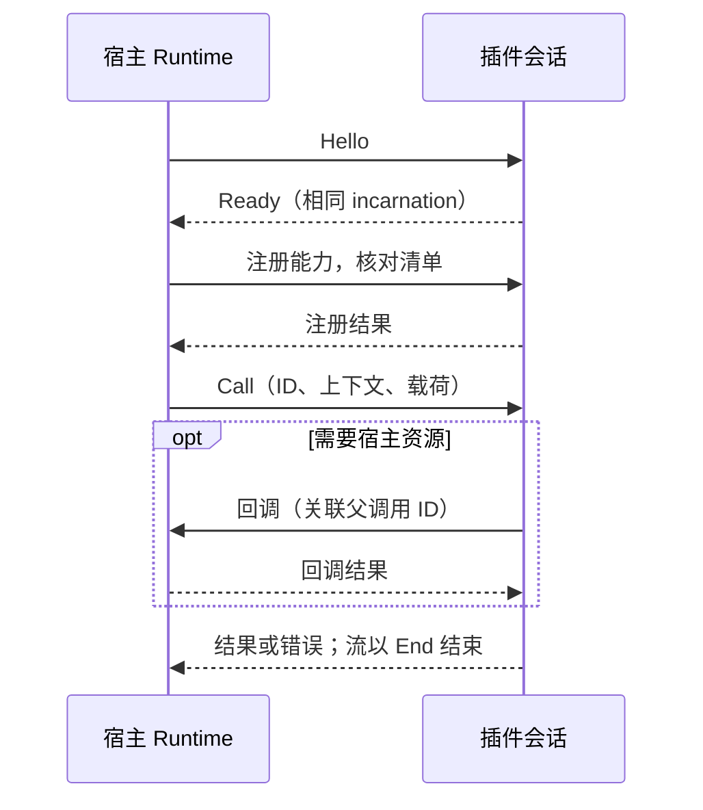

# Gateway Plugin SDK

用于编写 Codex Proxy 插件的 Rust 合同与可选会话辅助。插件只依赖本包，不依赖宿主 Core、Admin、Store 或 Host。
SDK 仍处于实验阶段；能力是否可用取决于宿主支持、清单声明与实际注册，
而不只是枚举中存在该名称

| 版本 | 当前值 | 用途 |
| --- | --- | --- |
| SDK 包 | `0.1.0` | Rust 开发依赖，独立于网关版本 |
| `manifestVersion` | `2` | 安装清单格式 |
| `package.protocolVersion` | `2` | 宿主与插件的进程通信 |
| `contributes.*.version` | 默认 `1`，`middleware` 为 `4`，`upstream_adapter` 为 `2` | 单项能力合同，见[扩展项声明](docs/manifest.md#扩展项简写) |

开发顺序：编写[清单](docs/manifest.md) → 实现[能力处理器](docs/capabilities.md) → 用 [CLI](../../../apps/plugin-cli/README.md)
打包 → [安装、配置与启用](../../../../docs/plugins.md)。完整可运行示例位于独立仓库
`codex-proxy-plugins` 的 `examples/workbench`

使用 AI 协作开发时，可调用仓库技能 [`$cpr-plugin-dev`](../../../../.agents/skills/cpr-plugin-dev/SKILL.md)，按任务定位合同、示例和验证入口

## 模块与依赖

| 入口 | 职责 |
| --- | --- |
| 根门面 | 清单、能力声明、调用上下文、消息与帧、公开错误 |
| `call::frontend_authentication` | 数据面认证信封、认证器标识与外部 principal 结果 |
| `call::model` | 宿主模型调用的 canonical 事实、原生 wire 与有界事件编解码 |
| `call::middleware` | HTTP、WebSocket 消息、公开服务、模型请求及 attempt 的洋葱调用、单次 next 与惰性正文合同 |
| `call::services` | 公开服务的类型化操作、输入输出及错误合同 |
| `call::upstream_adapter` | 内置 OpenAI / xAI 的[受管上游适配器](docs/upstream-adapters.md)注册、执行、出站与续接合同 |
| `call::policy` | 模型路由、账号调度与重试决策合同 |
| `call::catalog` | 固定 Provider 的模型别名注册合同 |
| `call::data` | 最小账号事实与已有额度观测的只读合同 |
| `call::observation` | 请求完成、用量、费用与实际上游 WebSocket 响应事件的统一观察合同 |
| `call::host` | 账号、私有状态、受管 HTTP、模型、亲和、日志及调用内流的宿主回调合同 |
| `call::management` | 管理 API、页面与资源声明、公开回调，以及 CLI 命令与待保存账号 |
| `client` | 通过 `io` feature 开启的 `PluginBuilder`、会话、中间件与异步帧收发 |

`call/` 按业务能力组织数据，`message.rs` 定义消息与帧。已有请求链的请求／响应改写、协议转换和思考参数映射使用
`call::middleware`；需要指定业务上游并解析结果时使用 `call::upstream_adapter`，作为洋葱链终端复用宿主账号与结算。
下游 WebSocket 改写使用 `websocket` 中间件；上游 WebSocket 的观察接口保留只读合同

插件使用的导入路径例如：

```rust
use gateway_plugin_sdk::{Frame, Message, PluginFault};
use gateway_plugin_sdk::call::{host::ModelEventBatch, model::ExecutionEvent};
// 需要 Cargo 依赖声明启用 features = ["io"]。
use gateway_plugin_sdk::client::{read_frame, write_frame};
```

默认 feature 不引入异步运行时。`io` 除帧编解码外，还提供 `PluginBuilder`、
`PluginSession::accept/run` 和 `PluginHandler`。组合插件从作者清单建立类型化方法，SDK 自动生成
`plugin.register`；作者不需要复制贡献项或手写方法名、阶段和敏感载荷编解码。
会话管理握手、有界并发、父调用关联、回调、流信用、取消、排空与关闭。
`ResponseStream::channel` 提供有界流生产入口，`ResponseStream::pull` 按消费进度驱动生产者；`PluginCall` 的宿主客户端只代表当前父调用，
不能把一个调用的资源误用到另一个调用。插件程序自行选择运行时和启动入口，不会启动网关。
`SessionConfig.maximum_stream_chunk_bytes` 默认 1 MiB，只约束单个业务流分块；
流式响应还需满足宿主实际授予的信用窗口。普通调用与回调的正文不受此预算限制。
普通业务处理器仍接收完整正文，内存占用随正文增长；HTTP 与下游 WebSocket 中间件使用惰性正文句柄，透传不复制正文

## 通信边界

启用 `io` 时优先用 [`PluginBuilder`](docs/capabilities.md#类型化作者入口) 组合业务处理器，再交给
`PluginSession::run`。仅实现中间件时也可直接使用
[`MiddlewarePlugin`](docs/capabilities.md#洋葱中间件)



### 帧与会话

`CallContext.timeout_ms` 限定初始处理期限。宿主对由流或连接 owner 管理的调用设置 `resource_stream`：
首个流式结果成功返回后，正文、会话及关联回调由资源取消与终态回收，不再沿用初始期限。
普通调用继续使用原期限；资源模式仍保留并发容量、Credit、父调用关联及取消约束

协议 v2 的帧头由大端 `u32` 元数据长度和大端 `u64` 正文长度组成，随后依次传输 JSON 元数据和原始二进制正文。
元数据保留 64 KiB 上限；正文总量不由插件传输层额外限制。传输内部以 256 KiB 为单次 I/O 块，
不逐块发起 RPC，也不要求插件配置与宿主同步。读取按进度扩展缓冲区；截断正文必须报错，不能作为完整消息交付

`read_frame` / `write_frame` 使用协议 v2。帧写入队列之前先用 `validate_frame` 校验元数据，
避免本地输入错误关闭共享传输。协议校验不会自动重试业务调用；部分读写中断后不能把当前位置当作新帧边界。
底层 `read_frame` / `write_frame` 不是取消安全的；自行编排会话时，不能在 `select!` 的其他分支完成后
重建半途中的帧读写。`PluginSession` 会在处理调用完成通知时保留同一个读取 future，直到完整帧到达或会话关闭

会话由宿主发送 `Hello`，插件校验协议后返回携带相同 incarnation 的 `Ready`。
注册结果必须与清单中的能力一致。一次 `Call` 的结果、错误和流帧按 ID 关联；回调必须
携带当前父调用 ID。实例、代次、阶段、账号或资源 ID 用于关联调用和管理资源生命周期

## 本地验证

设置服务的 SDK 类型和操作由宿主领域类型及[操作声明](../../gateway-admin/src/service/settings.rs)生成，SDK 构建不依赖宿主源码。
修改宿主合同后，在仓库根目录更新生成文件；Admin 合同测试会检查生成结果是否同步：

```bash
CPR_UPDATE_SERVICE_CONTRACT=1 RUST_MIN_STACK=16777216 cargo +1.97.0 test --manifest-path backend/Cargo.toml -p gateway-admin --test main sdk_settings_contract_matches_host_declarations --locked
cargo +1.97.0 fmt --all --manifest-path backend/Cargo.toml
```

SDK 自身的验证命令：

```bash
RUST_MIN_STACK=16777216 cargo +1.97.0 test --manifest-path backend/Cargo.toml -p gateway-plugin-sdk --no-default-features --locked
RUST_MIN_STACK=16777216 cargo +1.97.0 test --manifest-path backend/Cargo.toml -p gateway-plugin-sdk --all-features --locked
RUST_MIN_STACK=16777216 RUSTDOCFLAGS='-D warnings' cargo +1.97.0 doc --manifest-path backend/Cargo.toml -p gateway-plugin-sdk --all-features --no-deps --locked
```

源码中的类型和字段是当前合同；宿主接入、目录边界与 Runtime 集成验证见
[系统架构](../../../../docs/architecture.md)。Provider 固定为宿主内置的 OpenAI 与 xAI；插件实现只依赖公开 SDK 合同。
单元测试与文档构建不代替目标平台上的安装、配置及实际能力验证
