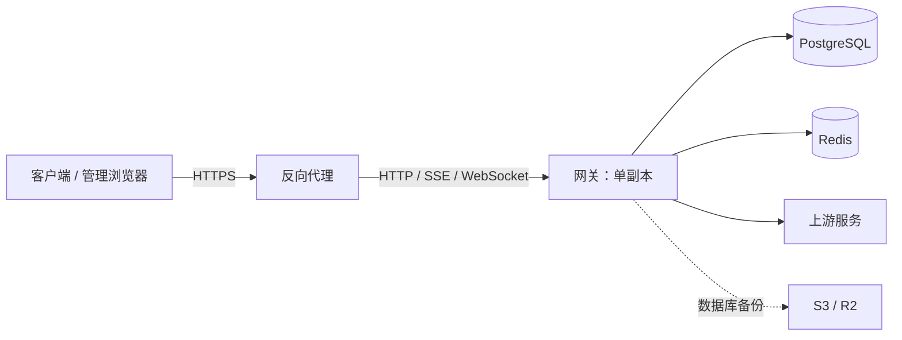

# 部署与运维

首次安装可按 [快速开始](../README.md#快速开始) 操作。
本文补充客户端配置、权限、备份和升级；部署命令从安装目录 `codex-proxy-rs/` 执行，
其中 `deploy/` 存放 Compose 文件和配置，`.runtime/` 存放持久化数据

| 任务 | 入口 |
| --- | --- |
| 安装与启动 | [手动安装](#手动安装) · [启动](#启动) · [公网访问](#公网访问) |
| 接入客户端 | [客户端配置](#客户端配置) · [登录与生图排查](#登录与生图排查) |
| 日常运维 | [运行设置](#启动后的运行设置) · [持久化与日志](#持久化与备份) · [请求排查](#请求错误排查) · [密码轮换](#密码语义) |
| 更新与恢复 | [镜像升级](#镜像升级与源码构建) · [在线更新](#管理端在线更新) · [备份与恢复](#备份与恢复) · [优雅关停](#优雅关停) |
| 运行源码 | [开发与源码联调](../docs/development.md) |

## 配置归属

配置按职责保存，不都在 YAML 中：

| 位置 | 内容 | 修改方式 |
| --- | --- | --- |
| `deploy/config.yaml` | 监听与数据库/Redis 连接地址、管理员初始密码、时区与日志等应用启动配置 | 从模板创建，已有部署合并修改，不覆盖原文件 |
| `.env` | Compose 使用的 `CPR_DATABASE_PASSWORD` 和 `CPR_REDIS_PASSWORD` | 安装器生成；手动安装设为 `0600` |
| `deploy/compose.yaml` | 镜像、容器网络、端口、挂载与资源限制 | 调整 Compose 并重建受影响容器 |
| PostgreSQL | 账号、Key、运行设置、上游身份、插件配置等业务数据 | 管理端或管理 API |
| 浏览器本地 | 主题和界面偏好 | 当前浏览器的主题设置 |

Compose 命令从安装目录运行，并通过 `--env-file .env` 明确读取根目录中的数据库与 Redis 密码，分别传给应用和服务容器；
后端进程本身不读取 `.env`。Compose 外启动时，应在 `store.*.password` 填写密码或设置对应进程环境变量。
镜像、构建与发布选项仍通过 Compose 环境变量配置。配置加载会忽略未知字段，并在启动控制台提示字段名；
不输出对应值。缺少必填字段时会指出缺项并停止启动，已知字段的类型和取值仍需合法；可选字段省略时使用默认值

后端从当前目录向上查找 `deploy/config.yaml`，相对数据、日志和静态资源路径以该文件所在目录解析

Compose 通过环境变量将监听和数据库地址设为容器内地址，并指定镜像中的静态资源目录

### 部署时区

在 `deploy/config.yaml` 设置统一的 IANA 时区，省略时默认 `Asia/Shanghai`：

```yaml
host:
  timezone: 'Asia/Shanghai'
```

支持 `UTC`、`America/New_York`、`Asia/Kathmandu` 等名称；空值、未知名称和错误类型会阻止启动，
错误指出 `host.timezone`，不输出配置值。修改后重启网关生效，二进制与 Compose 使用同一配置

管理端与 Key 用量页的时间文本由后端生成；自然日筛选、日统计、Key 限额、账号预热和备份 Cron 使用该时区。
浏览器、进程 `TZ` 和 PostgreSQL 会话时区不覆盖业务配置；Compose 的基础设施时间基准为 UTC。
上游请求身份中的位置时区仍由对应运行设置或代理配置控制，与部署时区独立

切换时区保留已打开限额窗口的 UTC 边界与用量，到期后按新时区续接；不会因重启立即清零。
备份调度从切换后的当前时刻计算未来执行点，不补跑旧时区漏过的任务，已入队任务保持原状态。
夏令时中不存在的预热或 Cron 时刻跳过，重复时刻只选较早一次。日志日期与保留规则见[日志与保留窗口](#日志与保留窗口)

## 部署结构



网关端口默认只绑定本机；数据库和 Redis 不对公网开放。插件以网关同一系统身份运行，不能作为不可信代码沙箱

## 手动安装

本节适用于 Linux amd64/arm64，需准备 Docker Engine、Docker Compose Plugin、curl 和 OpenSSL，
并确保当前用户能访问 Docker、可通过 `sudo` 或 root 设置目录权限。一键安装入口见
[快速开始](../README.md#一键安装)，脚本会自动完成本节准备和服务启动

下载同一正式 Release 的部署文件并设置目录权限：

```bash
mkdir -p codex-proxy-rs/deploy && cd codex-proxy-rs

# 只解析一次最新正式版本，确保两个文件来自同一 Release。
CPR_RELEASE_URL="$(curl -fsSL -o /dev/null -w '%{url_effective}' https://github.com/zyycn/codex-proxy-rs/releases/latest)"
CPR_RELEASE_TAG="${CPR_RELEASE_URL##*/}"
curl -fsSL "https://github.com/zyycn/codex-proxy-rs/releases/download/${CPR_RELEASE_TAG}/compose.yaml" \
  -o deploy/compose.yaml
curl -fsSL "https://github.com/zyycn/codex-proxy-rs/releases/download/${CPR_RELEASE_TAG}/config.example.yaml" \
  -o deploy/config.example.yaml

install -d -m 0750 .runtime/postgres .runtime/redis
sudo install -d -m 0770 -o "$(id -u)" -g 10001 .runtime/data .runtime/logs
sudo install -m 0640 -o "$(id -u)" -g 10001 deploy/config.example.yaml deploy/config.yaml
```

也可将 `CPR_RELEASE_TAG` 设置为指定的发布标签。Release 附带的 `compose.yaml` 默认使用该版本镜像，
配置模板和部署文件均包含在 `checksums.txt` 中；不要混用 `main` 分支模板与已发布镜像

为 PostgreSQL 与 Redis 分别生成一个密码：

```bash
openssl rand -hex 24
openssl rand -hex 24
```

把两个 48 位十六进制结果分别写入安装目录根目录的 `.env`：

```dotenv
CPR_DATABASE_PASSWORD=<第一个 48 位十六进制密码>
CPR_REDIS_PASSWORD=<第二个 48 位十六进制密码>
```

设置文件权限并另行填写 `deploy/config.yaml` 中的 `admin.default_password`：

```bash
chmod 0600 .env
```

管理员初始密码至少需要 12 个字符，不能是常见弱口令，也不能包含 `$`。
`client.session_ttl_minutes` 控制统一登录中密钥身份的固定会话有效期，默认 1440 分钟；管理员有效期仍由
`admin.session_ttl_minutes` 控制。两种身份共用一个 Cookie，成功登录替换旧会话；不改变 `/v1/*` 鉴权和限额

PostgreSQL 与 Redis 密码必须是 48 位十六进制字符。Compose 用 `.env` 中的两个变量覆盖
`store.*.password` 空占位，并传给对应服务；数据库和 Redis 密码不能嵌入连接 URL。
直接运行二进制时，须在 `config.yaml` 填入密码或为进程设置 `CPR_DATABASE_PASSWORD`、
`CPR_REDIS_PASSWORD`

Linux 上应用容器以 `10001:10001` 运行。应用数据和日志目录设为 `0770`，配置设为 `0640`，
均由当前用户持有、容器组 `10001` 访问；`.env` 保持 `0600` 且不挂载进应用容器。
`config.yaml` 通过 Compose `configs` 只读挂载，普通 Compose 保留宿主机文件的 UID/GID 和 mode

### Redis ACL 用户

连接已配置 ACL 用户的 Redis 时，把用户名写在 `store.redis.url` 中：

```yaml
store:
  redis:
    url: 'redis://u1@redis-host:6379/0'
```

将 URL 合并到已有配置，并把该用户的 48 位十六进制密码写入根目录 `.env` 的
`CPR_REDIS_PASSWORD`。Redis 服务端需事先创建并授权该用户。用户名中的 `@`、`:` 等特殊字符
需要 URL 百分号编码。未填写用户名时使用 Redis 的 `default` 用户

环境变量 `CPR_REDIS_URL` 优先于 `store.redis.url`。默认 `deploy/compose.yaml` 已将它设为
`redis://redis:6379/`，使用 ACL 用户时还需把应用服务的该环境变量改为
`redis://u1@redis-host:6379/0`，其中主机名必须能从应用容器访问；只改 `config.yaml` 不会生效。
默认 Compose Redis 服务使用密码认证，不会自动创建 ACL 用户

## 启动

```bash
docker compose --env-file .env -f deploy/compose.yaml config --quiet
docker compose --env-file .env -f deploy/compose.yaml pull
docker compose --env-file .env -f deploy/compose.yaml up -d --no-build --wait
docker compose --env-file .env -f deploy/compose.yaml ps
```

健康检查：

```bash
curl -i http://127.0.0.1:8080/healthz
```

`204 No Content` 表示应用、PostgreSQL、Redis 和后台任务的健康检查通过，不代表每个上游账号都可用

不要把未脱敏的 `docker compose config` 或 `docker inspect` 输出上传到工单；它们会包含
PostgreSQL/Redis 启动密码。日常校验使用 `config --quiet`

### 启动后的运行设置

在管理端修改以下设置，保存后对新请求生效，重启不会覆盖已保存的选择：

| 设置 | 入口与边界 |
| --- | --- |
| 上游客户端身份 | “系统设置 → 上游配置 → 客户端身份”；Key 可按 Provider 覆盖，支持自动或固定版本 |
| 全局请求位置 | “系统设置 → 上游配置 → 请求位置覆盖”；默认关闭，不从 YAML 导入 |
| 代理位置 | “代理管理”；优先于全局位置，全局关闭时仍可独立生效 |

位置覆盖只影响 OpenAI 请求中受支持的位置、日期与时区信息，不改变真实出口 IP、epoch 时间戳或系统时区。
`openai.residency` 是独立的部署约束。身份与位置字段见 [运行设置 API](../docs/api.md#8-运行设置)。
后台账号操作使用 Provider 自己的官方画像；发布资料刷新不改写用户选择或 `config.yaml`

### 插件命令行

使用与网关相同的工作目录和 `deploy/config.yaml`，读取制品已接受且当前已启用的插件实例：

```bash
codex-proxy-rs plugin --help
codex-proxy-rs plugin '实例ID' '命令' --help
codex-proxy-rs plugin '实例ID' '命令' --参数 '值'
```

将示例中的实例 ID、命令、参数名和值替换为插件实际提供的内容

不带子命令或使用 `serve` 时启动网关；插件命令不监听 HTTP、不启动后台任务，也不恢复或清理正在运行的
网关准入状态。顶层 `--help/--version` 不读取配置。插件帮助只读数据库，不执行迁移、登录或账号保存，
因此需要先由正常部署完成数据库初始化。宿主诊断保留在配置的文件日志中，stdout/stderr 专用于命令结果

参数支持 `--名称=值` 或 `--名称 值`；布尔参数可直接写 `--名称`，关闭时写 `--名称=false`。
duration 使用 `500ms`、`1m30s` 等带单位形式。参数可能进入 shell 历史和系统进程列表，不能因为插件声明
了敏感参数就认为命令行是安全的密钥输入通道；真实凭据优先使用对应插件提供的受控登录或导入入口

成功命令原样返回插件退出码与输出。命令受总期限约束，`Ctrl-C` 或终止信号会取消调用并回收插件进程。
若命令产生账号，只有成功结果才按顺序通过 Admin 保存；调用仍检查期限、实例版本和当前资源事实，
模型执行 Key 由具体调用选择，不在实例中预绑定。
部分保存后失败或取消不会自动重放，先核对账号和审计记录，再决定是否重新执行

独立仓库 `codex-proxy-plugins` 的 `examples/workbench` 提供命令行、请求处理与管理页面示例；模型相关操作会产生真实上游用量

## 公网访问

Compose 默认只绑定 `127.0.0.1`。从其他设备访问时，在应用前配置反向代理，
不要把 PostgreSQL 或 Redis 暴露到公网

同源登录页的管理员与 API Key 登录都支持 HTTP 和 HTTPS 登录。反向代理应原样保留浏览器的 `Origin`，
不要清除它或改写 Cookie 的 `Secure` 属性；HTTPS 反代可以使用 HTTP 回源。
HTTP 传输不加密，公网部署仍建议使用 HTTPS。
会话 Cookie 合同见 [管理接口鉴权](../docs/api.md#管理接口)

反向代理需要保留 `Authorization`，支持 `/v1/responses` 的 WebSocket Upgrade，
并关闭 SSE 响应缓冲。读取超时应覆盖长时间生成任务。
客户端使用部署地址下的 `/v1`，协议与部署一致，不要使用前端开发服务的 `5173/dev/v1`。
当前应用只支持单副本，不能通过复制容器扩容

流式响应在首个上游事件提交后，每 15 秒无输出会发送一次 SSE 注释保活，
并设置 `X-Accel-Buffering: no` 和 `Cache-Control: no-cache, no-transform`。
反向代理仍需允许这些响应头生效；首个事件到达前的等待也需要足够的读取超时

OpenAI 上游池化 WebSocket 默认每 25 秒发送一次 Ping，发出后允许等待 30 秒；
收到 Pong 或其他入站帧即解除本次心跳截止，持续无响应则以 `pong_timeout` 关闭连接。
此策略也覆盖正在生成的请求，与等待下一条上游消息的 `stream_idle_timeout_ms` 分别计时

若 Codex 在压缩或长时间生成时出现 `error decoding response body`，这表示
客户端读取 HTTP 响应体失败。请结合网关请求诊断中的 `upstream.read.failed`、
`downstream.body.closed` 和反向代理日志判断断开位置，不能仅凭此消息认定是 JSON 格式错误。
SSE 注释保活用于防止传输链路空闲断开，不会重置 Codex 等待完整 SSE 事件的超时；
若报错为 `idle timeout waiting for SSE`，再检查客户端的 `stream_idle_timeout_ms`

## 客户端配置

在管理端创建客户端密钥，打开「使用密钥」，按操作系统复制 `config.toml` 和 `auth.json`，
或通过 CCSwitch 导入。已有文件先备份，合并后完全退出并重启 Codex。
CCSwitch 导入同时配置当前 Key 的日／周额度查询，当前 Provider 默认每 30 分钟刷新。
查询地址和凭据随导入生成，在 CCSwitch 中修改 Provider 的地址或 Key 后，需重新导入以同步用量查询

Linux/macOS 默认目录为 `~/.codex/`，Windows 为 `%USERPROFILE%\.codex\`；
设置过 `CODEX_HOME` 时以该目录为准。Provider 设置应写入用户配置，不要只写到项目目录。
配置层级见 [官方配置参考](https://learn.chatgpt.com/docs/config-file/config-reference)

### config.toml

以下示例与当前管理端模板的配置项一致。替换地址和密钥，模型可改成该密钥有权限使用的模型：

```toml
model_provider = "OpenAI"
model = "gpt-5.6-terra"
review_model = "gpt-5.6-terra"
model_reasoning_effort = "max"
service_tier = "default"

[model_providers.OpenAI]
name = "OpenAI"
base_url = "http://127.0.0.1:8080/v1"
wire_api = "responses"
supports_websockets = false
requires_openai_auth = false
# 填写代理密钥，真实账号由服务端管理。
experimental_bearer_token = "<client-api-key>"

[model_providers.OpenAI.http_headers]
# 供客户端识别服务端托管认证，本身不是密钥。
X-OpenAI-Actor-Authorization = "proxy-managed"

[features]
image_generation = true
goals = true
```

`OpenAI` 是自定义 Provider ID，大小写要与 `model_provider` 一致。合并配置时修改已有表，
不要重复添加 `[features]` 或 Provider 表。更换模型时也要检查其支持的推理强度。
密钥以明文保存，文件仅供本人读取，不要提交到 Git

需要指定完整模型目录时，在账号的模型列表中导出所选 Codex 模型，并在 `config.toml` 顶层设置
`model_catalog_json = "/absolute/path/to/cpr-model-catalog.json"`。导出文件不含账号凭据；
它是一次目录快照，调整选择或上游模型能力变化后需重新导出

### auth.json

```json
{
  "OPENAI_API_KEY": "<client-api-key>"
}
```

使用 `auth.json` 读取密钥的客户端或 CCSwitch 可保留这份文件。上述 Provider 配置从
`experimental_bearer_token` 读取代理密钥，可与仅含 API Key 的 `auth.json` 共存。
真实 OpenAI OAuth 账号文件用于管理端账号导入，不要当作代理配置分发给客户端

### 生图和 WebSocket

模板启用原生生图。Codex 可在任务需要图片时调用 `image_gen.imagegen`，
再通过代理的 Images 接口生成或编辑图片；也可以在需求中明确要求生成并使用图片。
需要支持该能力的客户端、支持图片输入的对话模型，以及有生图权限和额度的 OpenAI 账号。
代理不会增加上游权限，xAI 账号不能承接这些 Images 请求

生图不要求开启 WebSocket。要启用客户端 WebSocket，把当前 Provider 的
`supports_websockets` 改为 `true`，并检查反向代理是否允许 Upgrade

客户端到代理、代理到上游是两段独立连接。客户端关闭 WebSocket 后，
服务端仍可能用 WebSocket 访问上游；客户端开关不控制服务端连接池和 HTTP 回退策略。
OpenAI OAuth 账号的上游传输方式默认 WS；固定为 SSE 的账号不承接必须依赖 WS 的预热及连接内续接。
仅使用这类账号时，客户端保持 `supports_websockets = false`，避免先尝试 WS 再回退

### 客户端配置兼容

仅含代理密钥的 `auth.json` 配合 `requires_openai_auth = true` 仍可用于已有请求，
但 API Key 登录本身不会启用原生生图。需要生图时换用上述 Provider 配置

使用 Codex 0.153.4 时，旧配置中的以下字段需删除或替换：

| 字段 | 处理 |
| --- | --- |
| 顶层 `disable_response_storage` | 无有效配置定义，删除 |
| 顶层 `network_access = "enabled"` | 无有效配置定义，删除；不是客户端 API 的联网开关 |
| `features.responses_websockets_v2` | 已标记移除，使用 Provider 的 `supports_websockets` |

`image_generation` 和 `goals` 仍有效。不要为了接入代理，顺带扩大命令沙箱的联网或文件权限

### 登录与生图排查

- 仍提示登录：确认实际读取的用户配置目录、选中的 Provider 和客户端版本，再完全退出重启。
  新 Provider 使用 `requires_openai_auth = false`，不依赖本地 ChatGPT 登录
- 没有生图工具：检查配置是否被覆盖、Actor 标记是否保留、模型是否支持图片输入。
  官方客户端还会检查缓存登录状态；已核验版本在本地账号为 Free 时会隐藏生图。
  先备份并区分本地真实账号文件与代理密钥文件，不要直接删除全部登录状态
- 已调用生图但失败：查看服务端账号的凭据、权限、额度和请求错误，不能只凭文本对话成功判断
- `401`：检查代理密钥是否正确、是否启用；Actor 标记不能代替密钥
- `426`：检查客户端版本及反向代理是否保留版本头，低于管理员设置的最低版本时需要更新客户端。
  手机远程控制的版本识别范围见 [版本门禁规则](../docs/api.md#1-鉴权与公共约定)
- 地址包含 `5173/dev/v1`：这是开发代理地址，依赖 Vite 服务。日常使用改成后端或 HTTPS 地址；
  验证 WebSocket 时直接连接后端，当前 Vite 代理未显式开启 WebSocket 转发

其他客户端使用 Responses API、`/v1` Base URL 和代理密钥即可，不需要 Actor 标记。
路由与请求格式见 [API 参考](../docs/api.md#3-openai-数据面与模型目录)

## 优雅关停

收到停止信号后，应用先停止接收新连接并 drain 存量连接；整个 drain 共享一个从停止信号
起算的绝对截止点（`host.drain_timeout_seconds`，默认 30 秒），逾期放弃等待，存量连接随
进程退出终止。drain 结束后才关停后台 worker，预算为
`host.worker_shutdown_timeout_seconds`（默认 30 秒），两段预算按最坏情况串联

Compose 的 `stop_grace_period` 为 75 秒，覆盖默认 30 秒 HTTP drain、30 秒 worker 收尾和额外调度
余量。若调大任一应用超时，也必须把 `stop_grace_period` 调到大于两段超时之和；否则 Docker 会在
宽限期结束时 SIGKILL

## 本地开发

源码环境、前后端启动与组件库联调见 [开发与源码联调](../docs/development.md)

本机开发可使用 Compose 提供 PostgreSQL 和 Redis，集成测试另用[专用测试库](../backend/migrations/README.md#本地测试库)

## 持久化与备份

### 数据目录

Compose 使用以下绑定目录：

| 目录 | 内容 |
| --- | --- |
| `.runtime/data` | OpenAI 会话锚点密钥、更新状态、临时更新目录与备份暂存区 |
| `.runtime/logs` | 应用文件日志、按需启用的 OAuth 恢复记录与请求转储 |
| `.runtime/postgres` | PostgreSQL 持久化数据 |
| `.runtime/redis` | Redis AOF |

普通 `docker compose --env-file .env -f deploy/compose.yaml down` 不会删除这些目录。删除 `.runtime` 会永久清除本地状态

PostgreSQL 是账号、Client Key、运行设置、请求记录与审计的权威存储；账号 credential 按
Provider schema 以明文 JSON 保存于 PostgreSQL。Redis 只保存可重建、可过期的协调状态，例如
会话亲和、lease、cooldown、OAuth pending flow 与套餐模型目录 cache

备份应覆盖哪些目录、如何生成一致性数据库归档，见 [备份与恢复](#备份与恢复)

### 日志与保留窗口

文件日志以时间完整性为清理依据，**没有文件数量淘汰上限**：

| 文件集 | 保留配置 | 默认完整窗口 |
| --- | --- | --- |
| 普通日志、OAuth 恢复日志 | `host.logging.file.retention_days` | 前 7 个完整自然日及当天 |
| 全量请求/响应报文 | `host.logging.request_dump_retention_days` | 前 1 个完整自然日及当天 |

文件名统一为 `codex-proxy-rs-<类别>.YYYY-MM-DD[.N].log[.gz]`，类别分别为
`application`、`oauth-recovery`、`request-dump`。专用 tracing target 为 `oauth_recovery` 和
`request_dump`；普通日志保留各 Rust 模块的 target，便于按模块过滤。
程序只管理上述规范名称的日志，其他命名的文件由运维手动清理。
普通日志未配置 `retention_days` 时默认使用 7 天，显式配置优先

日志时间戳采用部署时区并携带数字偏移，文件按该时区的日期轮转和整组保留：例如 9 月 8 日配置 1 天，会保留 9 月 7 日全天及 9 月 8 日的所有分片，
到 9 月 9 日才允许清理 9 月 7 日。这会略多保留，保证跨午夜及高流量时不留下半天日志。
配置 7 天同理，保留前 7 个完整自然日及当天，夏令时日期允许为 23 或 25 小时。切换时区不重命名历史文件；
按文件名日期与部署时区中的实际修改日期取较近值，旧日期分片近期被写入时整组延后删除。
`max_file_size_mb` 仅决定分片大小（默认 20 MiB），不决定保存时长，单条大记录不会被截断。
关闭的分片压缩为 `.log.gz`；成功压缩、同步并发布归档后才删除原文件，保留原修改时间。
清理发生在启动和轮转时；空闲期间过期文件可能暂时多保留。检索时须同时读取 `.log` 与 `.log.gz`

报文开关为 `host.logging.request_dump`，默认关闭；开启时原始报文按块完整写入独立文件，
数据库请求诊断仍是有界摘要，不能用摘要事件数代替全量报文完整性

OAuth 恢复开关为 `host.logging.oauth_recovery`，默认关闭，与普通文件日志开关分别控制：

- 开启后，OpenAI 每次成功取得 AT 和可用 RT 时，在资料补全及数据库写入前写入独立的 `oauth-recovery` 文件集
- 该通道不受普通日志级别过滤，关闭时也不会改写到普通日志或 stdout；有界队列满时等待写入

恢复记录和请求转储含原始凭据，`.runtime/logs` 须按敏感数据控制访问和备份

文件写入使用有界队列背压，正常退出会排空队列并同步文件。`file_logging` 健康探针在写入/同步失败后
报告 `Unhealthy`，本次进程内恢复写入也不会清除已有缺口；压缩或清理失败报告 `Degraded`。
断电、强杀或磁盘故障可能造成日志丢失；需要恢复已删除文件时，应使用独立备份。
容量不足时不会提前删除保留窗口内日志，必须根据完整日期的压缩后实际用量规划空间，并监控磁盘余量和
健康探针。Docker stdout 的独立轮转不承担应用文件日志的完整保留承诺

完整运行时、Provider、revision 与恢复边界见 [架构文档](../docs/architecture.md)

## 请求错误排查

1. 先记录故障时间和时区、网关版本/提交、客户端名称与版本，以及 HTTP/SSE/WebSocket 传输。
   区分“上游返回”“网关实际响应”和“客户端终端展示”，不要只凭终端的统一文案推断根因
2. 收集响应中的 `x-gateway-request-id`、`x-request-id` / `x-oai-request-id`；配置了
   `api.request_id_header` 时也记录该入口头。WebSocket 合成错误的关联头位于本条错误的 `headers`。
   在管理端错误列表按 ID 和时间搜索；检查平台条件并主动刷新，翻页不会推进查询时间。
   只有入口 ID 时，改用入口日志和时间定位
3. 打开错误详情，核对上游/客户端状态、发送状态、attempt、失败阶段及后续恢复关联。
   下载默认诊断包作为反馈材料，先看 `availability`、`attemptsComplete` 和淘汰计数；
   该包不含原始错误正文或完整 trace data。分享前仍应检查关联 ID 等内部信息
4. 需要更细上下文时，在 `codex-proxy-rs-application.*.log` 及 `.log.gz` 中按网关/上游 ID
   和时间检索，结合 `attempt.started`、`attempt.failed`、`request.finished` 与 transport 阶段判断。
   **开启 `host.logging.file.enabled` 时，stdout 仅保留 `gateway_startup` 通道**；
   `docker logs` 看不到业务错误不代表没有错误。关闭普通文件日志且开启 `host.logging.stdout`
   时，普通日志才按级别输出到 stdout；专用 dump/OAuth 恢复通道不会混入
5. 查不到请求记录时，先用模型执行 ID 在“全部平台”下搜索：已进入执行会话的建流前失败也会记录，
   但其 attempt 为零，尚未确认的 Provider/账号/传输为空，不会命中具体平台或账号筛选。
   再检查观测队列丢弃/写入失败告警及 `file_logging` 健康状态。鉴权、解析、路由和准入等入口拒绝
   仍不保证进入错误列表；应结合入口状态与日志，不能据此认定请求未发生。异步投影有延迟，
   刷新后仍需核对缺口，而不是反复重放可能已发送的请求
6. 仅在上述信息不足且能够控制访问范围时临时开启 `host.logging.request_dump` 复现一次。
   它会记录完整凭据与用户正文，应限定访问、摘取最小片段并人工脱敏；复现后关闭开关，
   按配置的保留窗口及组织的数据处理要求管理已生成文件。不要为普通请求排查开启 OAuth 恢复记录，
   也不要直接上传整个日志目录或完整转储

请求问题反馈使用 [接口问题反馈表单](../.github/ISSUE_TEMPLATE/api-bug-report.yml)；错误诊断与查询合同见
[API 文档](../docs/api.md#10-dashboard用量与错误)

### 插件取文与 DNS

插件受管 HTTP 由实际运行网关的主机或容器解析 DNS，再通过直连或账号代理访问目标。插件拥有完整网络访问能力，宿主不按插件身份限制私网、回环或保留地址

域名解析失败时先核对网关运行环境的 DNS。Clash / Mihomo 的 Fake-IP 地址需要相应代理接管；无法连通时可让目标域名返回真实地址，并检查所选代理。代理失败不会自动回退直连

排障区分域名解析失败、超时、连接失败和响应读取失败，避免在日志或截图中输出真实请求头、正文及凭据

## 密码语义

- `admin.default_password` 只在首次创建管理员时使用
- 已有管理员在「系统设置 → 安全与访问 → 管理员密码」修改登录密码，需要验证当前密码；修改后所有管理员会话失效，使用新密码重新登录
- PostgreSQL 官方镜像只在空数据目录初始化时使用 `CPR_DATABASE_PASSWORD`
- Redis 在每次容器创建时使用 `CPR_REDIS_PASSWORD`

已有 PostgreSQL 数据目录后，直接修改 `.env` 不会修改数据库用户密码，只会导致应用无法连接。
轮换时必须先在 PostgreSQL 中修改用户密码，再同步更新 `.env`。Redis 密码变更后需要用新配置重新创建
Redis 和应用容器，不需要删除 Redis 数据目录。
安排维护窗口，避免应用和 Redis 在过渡期间使用不同密码

## 镜像升级与源码构建

每个 Release 独立提供 `config.example.yaml`、默认镜像固定到该版本的 `compose.yaml` 和校验和；
各平台归档也包含 `deploy/config.example.yaml`。配置模板来自构建该版本的同一提交。
使用二进制归档手动部署时，将模板中的 `api.asset_directory` 改为 `../web/dist`，指向归档内的静态资源。
在线更新默认使用同一目录；如显式设置 `host.system_update.web_dist_dir`，应确保它指向实际提供页面的目录。
升级时先阅读目标版本说明，下载同一 Release 的部署附件，对比模板并合并必要配置，保留已有凭据
和 Compose 自定义项。不要用模板覆盖 `config.yaml`，也不要从 `main` 下载模板搭配旧镜像。

从旧版 Compose 凭据桥接配置升级时，先把 `config.yaml` 中现有的数据库和 Redis 密码原样迁到根目录
`.env` 的 `CPR_DATABASE_PASSWORD`、`CPR_REDIS_PASSWORD`，再将 YAML 密码字段清空，并把 `.env`
权限设为 `0600`。保持密码值不变，不需要修改 PostgreSQL 用户密码或删除 Redis 数据。
一键安装器遇到已有 `config.yaml` 会保留旧部署文件，不执行此迁移；请按本节手动升级步骤操作。

按现有配置和接入方式检查以下升级条件：

| 适用条件 | 升级操作 |
| --- | --- |
| `config.yaml` 含 `openai.wire_profile.location` | 该字段会被忽略，可删除；如需继续覆盖请求位置，将值填入管理端全局请求位置并开启开关，数据库初始化不会自动导入 |
| `config.yaml` 含 `host.logging.file.max_files` | 该字段会被忽略，可删除；日志按 `retention_days` 保留，`max_file_size_mb` 只控制分片大小 |
| 使用旧管理员认证接口或 Cookie | 改用 `/api/auth/*` 并重新登录；会话合同见 [认证 API](../docs/api.md#4-浏览器认证) |

更新部署文件后，从安装目录拉取目标版本镜像并重建应用容器：

```bash
docker compose --env-file .env -f deploy/compose.yaml pull codex-proxy-rs
docker compose --env-file .env -f deploy/compose.yaml up -d --no-build --wait codex-proxy-rs
```

源码构建需要克隆源码仓库并准备配置与数据目录，构建过程自动准备前端依赖，无需初始化子模块或准备额外 build context。以下命令从仓库根目录执行：

```bash
docker compose --env-file .env -f deploy/compose.yaml build codex-proxy-rs
docker compose --env-file .env -f deploy/compose.yaml up -d --no-build --wait
```

升级后通过管理端版本接口或容器 image digest 确认运行实例的版本和 revision

构建元数据通过一次性进程环境传入：

```bash
CPR_VERSION="$(ruby -ryaml -e 'puts YAML.load_file("release/version.yaml").fetch("version").delete_prefix("v")')" \
CPR_GIT_SHA="$(git rev-parse HEAD)" \
CPR_BUILD_TIME="$(date -u +%Y-%m-%dT%H:%M:%SZ)" \
docker compose --env-file .env -f deploy/compose.yaml build codex-proxy-rs
```

### 版本命名与升级规则

管理端「系统更新」可临时选择通道检查更新，不保存选择，不会自动下载或安装。
每次打开弹窗按当前运行版本匹配通道：正式版为 Stable，预发行按版本后缀匹配。
升级并重启后按新运行版本匹配；侧栏更新提示始终使用当前运行通道。预发行编号 `N` 从 1 开始递增

| 通道 | 命名示例 | 接收的版本 |
| --- | --- | --- |
| Stable | `3.12.0` | 正式版 |
| RC | `3.12.0-rc.1` | RC、正式版 |
| Beta | `3.12.0-beta.1` | Beta、RC、正式版 |
| Alpha | `3.12.0-alpha.1` | Alpha、Beta、RC、正式版 |
| Exp | `3.10.0-exp.1` | 同一轮实验中编号更高的 exp，仅实验实例可选 |

普通通道在同一大版本内持续接收更高版本，包括后续小版本和补丁版本的预发行。
切回 Stable 不会降级：例如运行 `3.16.0-beta.2` 时，不能安装 `3.15.1`，需要等待 `3.16.0` 或更高正式版。
下载、安装或待重启期间不能切换通道

同一 `X.Y.Z-exp.N` 系列只用于同一轮实验，不能混用不同实验分支；变更基线即进入另一实验线，需手动迁移。
exp 不进入正式版、alpha、beta 或 rc，普通实例也不能选择 Exp。
从 exp 切换正式版时需先备份，在目标版本的独立数据库中迁移业务数据，不能直接复用或整库还原实验数据库

版本大小遵循 [SemVer](https://semver.org/)，构建元数据 `+...` 不参与比较。未知预发行标识不提供在线更新。
更新器先过滤不允许的目标，再选择版本最高的候选；其他通道或更高大版本领先，不影响当前发行线的更新。
只有当前官方构建满足在线更新条件且存在允许安装的新版本时，才返回“有可用更新”。否则不显示更新标记、
其他通道的版本及发布说明，手动检查显示“当前没有可用更新”。检查失败单独报告，不能当作没有更新

alpha、beta、rc、exp 在 GitHub 标记为 Pre-release，不覆盖 GitHub Latest 或镜像 `latest`。
允许连续升级的发行线从首次发布起遵守[迁移冻结规则](../backend/migrations/README.md#冻结规则)，
包括预发行到正式版的晋级；发版前验证对应升级路径，不能仅凭版本号认定数据库兼容

### 管理端在线更新

官方构建按上述规则在线更新；源码等非官方构建返回不支持原因，不提供可用更新。
点击「下载并更新」后，操作日志显示下载、校验与安装过程，完成后显示「待重启」及待生效版本，重启后才使用新程序。
「当前版本」始终表示正在运行的版本，「通道最新」表示所选通道的检查结果

手动更换镜像或程序后，更新器会核对安装文件并校准历史状态，不以旧成功记录推断需要重启。
运行期间检测到外部文件变动或文件缺失时会报告异常，需要核对完整发行包并重启服务后再检查。
回滚入口只接受与记录指纹一致的完整备份；缺少指纹，或备份被替换、丢失时，不提供在线回滚，
但不会删除备份文件。此时需要按人工部署流程恢复已经核实的发行包

直接运行二进制时，若未设置 `CPR_ENABLE_SELF_RESTART=true`，管理端自重启默认关闭。
在现有 `deploy/config.yaml` 的 `host` 下合并以下配置：

```yaml
host:
  system_update:
    deployment_mode: binary
    self_restart_enabled: true
    executable_path: '/opt/codex-proxy-rs/codex-proxy-rs'
```

`executable_path` 为可选项：未指定时，服务在启动时解析并固定当前程序路径；
显式配置时，将示例改为实际程序的绝对路径。`self_restart_enabled` 控制管理端的「立即重启」操作；
修改配置后需手动重启当前服务一次才会生效。
以上三个字段也可分别通过 `CPR_DEPLOYMENT_MODE`、`CPR_ENABLE_SELF_RESTART` 和 `CPR_UPDATE_EXE_PATH` 设置，
YAML 中显式配置的值优先于对应环境变量

Compose 提供以下在线更新运行参数：

- `CPR_UPDATE_REPOSITORY`：只接受 `owner/repository`；默认 `zyycn/codex-proxy-rs`
- `CPR_GITHUB_API_BASE`：正式环境必须为 `https://api.github.com/repos`
- `CPR_UPDATE_EXE_PATH`、`CPR_WEB_DIST_DIR`：分别指向容器内二进制和前端静态目录；
  `CPR_WEB_DIST_DIR` 同时供页面服务与更新器使用，相对路径以 `deploy/config.yaml` 所在目录为基准
- 更新临时目录、状态文件和锁文件默认由 `host.runtime_data_dir` 派生；
  `CPR_UPDATE_TEMP_DIR`、`CPR_UPDATE_STATE_FILE`、`CPR_UPDATE_LOCK_FILE` 仅用于显式覆盖
- `CPR_ENABLE_SELF_RESTART=true`：更新或回滚完成后允许管理端请求重启；Docker 进程退出后由
  Compose 的 `restart: unless-stopped` 拉起新进程

`CPR_UPDATE_CHANNEL` 不参与版本选择，配置中存在该变量时可删除

Release 必须提供当前 OS/架构的 `codex-proxy-rs_<version>_<os>_<arch>.tar.gz` 与
`checksums.txt`。服务会在替换前再次查询远端最新版本，校验下载 host、声明大小、SHA-256 和
归档路径；二进制或静态资源任一替换失败时恢复旧文件。成功后的旧二进制和旧静态目录分别保留为
`*.backup`，管理端 rollback 会交换当前文件与这份备份。更新状态和跨进程锁可在以下位置排查：

```text
.runtime/data/update-state.json
.runtime/data/update.lock
.runtime/data/update-tmp/
```

### 插件兼容与发行目录

教学示例在 `codex-proxy-plugins` 独立构建和发布，通过[插件管理](../docs/plugins.md)安装。
宿主发行物当前不内置插件，但仍包含用于兼容检查的封口清单

| 文件或目录 | 用途 |
| --- | --- |
| `plugin-release-manifest.json` | 固定宿主版本、提交、平台与支持的插件合同；插件列表当前为空 |
| 可执行文件同目录的 `plugins/official` | 随受信宿主发行物部署的只读目录，与二进制、Web 资源成套更新或恢复 |

- 下载更新时校验发行身份，插件合同不兼容不阻止安装。点击重启时检查已安装目标版本，列出不兼容插件的名称和原因；确认后批量停用并重启，保留包体、配置、密钥和私有数据，取消不修改插件状态
- 回滚仍检查启用插件与旧宿主的兼容性，不兼容时先停用对应插件。更新或回滚期间的并发配置变更会阻止切换，文件替换失败或取消时恢复整组文件
- 非空官方清单中的包经身份、平台和摘要校验后幂等导入；导入不确认信任、不创建配置、不启用，也不删除旧包。管理员确认信任后才执行默认配置流程；重复摘要保留首次安装出处
- `sealed` 是构建封口标记，不是密码学签名。普通上传、URL 或 GitHub 安装不能获得 `builtin` 身份，独立教学示例也不例外

已安装制品的元数据读取允许未知字段，可选字段缺失时使用已定义的默认值；无需仅为这些字段差异重新安装。
废弃字段由启动迁移统一清理，制品摘要、包体、接受事实与实例配置继续保留。缺失必需身份、数据类型错误、
清单或协议不兼容不会因此被忽略，仍需按具体错误处理；不要手动删除元数据字段或修改迁移 checksum 来绕过检查

使用不支持 `plugins/official` 目录的更新器时，须完整解压平台发行包或更新正式容器镜像，确保发行文件齐全。
macOS arm64 提供构建产物；部署前需验证目标平台的插件运行与上游调用，不能只以打包成功判断可用

## 备份与恢复

数据库可用管理端的 S3/R2 逻辑备份，或停止 PostgreSQL 后备份数据目录

不要在 PostgreSQL 写入期间直接复制数据目录作为一致性备份

| 需要保留的内容 | 备份方式 |
| --- | --- |
| 账号、Key、设置、请求、审计与插件数据 | 完整数据库归档，或停库后备份 `.runtime/postgres` |
| 部署配置与凭据 | 单独备份 `deploy/config.yaml`、根目录 `.env` 及 Compose 自定义配置 |
| 应用日志与已启用的 OAuth 恢复记录 | 单独备份 `.runtime/logs`，不包含在数据库归档中 |
| 会话锚点与节点运行文件 | 按需备份 `.runtime/data` |
| 短期协调状态 | 按需备份 `.runtime/redis`，数据库冷恢复时使用空 Redis |

OpenAI 主动额度重置卡及消费结果由上游持有，不属于本地备份内容

数据库、配置、根目录 `.env`、插件敏感设置和 OAuth 恢复日志均按凭据保护；恢复 `.env` 后设为 `0600`

### 备份内容与限制

- 插件包体、固定来源、下载凭据、制品接受事实、实例配置、版本配置快照、敏感配置、功能范围绑定和私有状态都保存在
  PostgreSQL，随数据库一起备份。插件通过宿主回调读写的内置平台账号保存在同库的通用账号表。
  来源使用的出站代理及其认证也须随库恢复，不能只备份 `plugin_*` 表；来源代理与账号代理独立选择，
  不依赖进程代理环境，故障时不会自动回退直连。
  包体单个上限为 32 MiB，需要计入数据库及备份容量；解压运行目录和 Redis 协调状态是可重建数据，
  不作为插件安装或制品接受事实。恢复时保留制品接受状态、实例配置、账号引用和状态代次的一致性；插件降级仍须
  通过状态兼容校验，不通过手工替换缓存目录回滚
- 官方运行镜像内置与 Compose 数据库服务版本一致的 `pg_dump` / `pg_restore`，无需额外安装。
  自行替换 PostgreSQL 版本时，应同步核对备份工具版本
- 备份暂存目录为 `host.runtime_data_dir/backup-staging`；Compose 默认对应
  `/app/.runtime/data/backup-staging`，由 `.runtime/data` 卷持久化，权限 `0700`（仅 `cpr`
  用户可读写）。部署卷至少预留一个最大数据库归档的空间
- S3/R2 存储、Cron 计划、保留策略与备份记录都保存在 PostgreSQL（`backup_settings` /
  `backup_records`），备份记录行在删除成功后硬删除，操作历史进入 `admin_audit_events`
- 手工备份的 `expiresInDays` 在创建时生成独立 `expires_at`；计划备份按当前 `retentionDays` 生成
  `expires_at`，并同时受 `retentionCount` 清理规则约束。到期只进入删除流程，不构成在线恢复点

### 人工恢复数据库

备份归档由 `pg_dump --format=custom --no-owner --no-privileges` 生成，可通过标准 PostgreSQL
工具离线恢复：

```bash
pg_restore --no-owner --no-privileges --password \
  --dbname='postgresql://restore_user@127.0.0.1:5432/restore_db' backup.dump
```

示例中的账号、空目标库和归档路径需按实际情况替换，密码由命令交互输入

恢复期间与恢复后的边界见 [架构文档](../docs/architecture.md#11-生命周期安全与恢复)。
当前没有在线恢复 API，也没有供部署者直接启用的“维护模式”开关：

1. 先备份现有数据库，并停止应用；在独立的空数据库中恢复归档，检查数据和迁移版本
2. 应用保持停止，离线核对备份设置与记录。禁用快照中的旧计划，处理非终态记录
   （`queued/dumping/uploading/deleting`）、旧调度游标和到期清理条件，再决定哪些记录保留
3. 使用空 Redis 和空插件解包缓存做一次冷启动；逐一核对已启用实例的包摘要/平台、制品接受状态、配置与绑定、账号引用、
   私有状态 schema/代次，并执行实际插件操作。缺少或损坏必需包体、引用不完整或状态不兼容时，恢复不能
   记为成功，也不能用相同插件 ID 的其他包替代
4. 确认不会误执行旧任务或删除恢复前的远端对象后，再接入业务流量；重新测试 S3 连接并设置计划

只关闭计划备份不会停止 Worker 的任务恢复和到期删除。无法确认这些记录的影响时，
不要把恢复后的数据库直接接入运行中的应用。具体处理应根据目标库数据制定，不提供清空生产记录的通用命令
