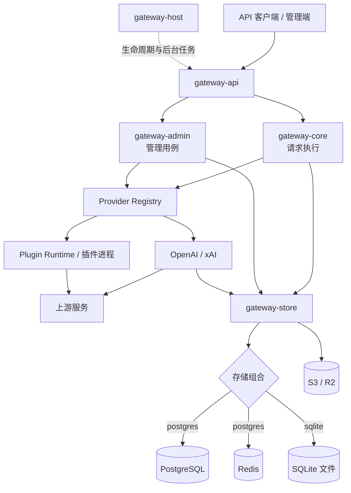
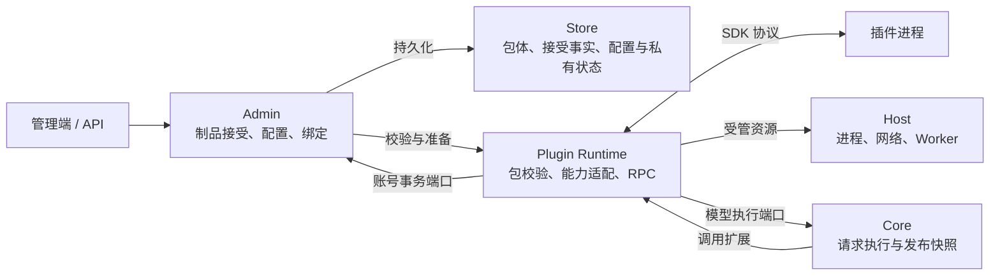
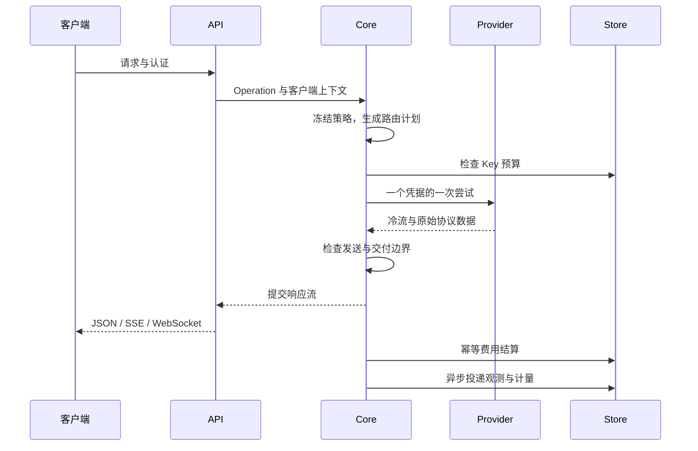

# Codex Proxy RS 架构

本文说明模块职责、请求流程、状态存储和必须保持的约束。
具体 HTTP 字段见 [接口文档](api.md)，部署参数见 [部署文档](../deploy/README.md)；上游 URL、超时、
重试间隔和 UI 布局属于源码或配置，不在架构文档重复维护

| 阅读目标 | 章节 |
| --- | --- |
| 了解模块与插件边界 | [运行拓扑](#2-运行拓扑)、[Workspace](#3-workspace-边界)、[插件扩展](#31-插件扩展)、[前端职责](#34-前端模块职责) |
| 跟踪一次请求 | [请求生命周期](#4-数据面请求生命周期)、[协议边界](#5-provider-与协议边界)、[路由与结算](#6-路由账号范围与-continuation) |
| 修改配置与持久化 | [控制面](#7-控制面与-revision)、[状态所有权](#8-状态所有权) |
| 维护运行行为 | [凭据与额度](#9-credential额度与主动重置)、[观测与任务](#10-观测与后台任务)、[生命周期](#11-生命周期安全与恢复) |

## 1. 系统定位

Codex Proxy RS 是单进程、单副本运行的多 Provider AI 网关，同时提供：

- 面向客户端的 OpenAI Responses、Images、standalone Search 和模型目录协议
- 面向管理员的 `/api/admin/*` 控制面和 Vue 管理端
- 面向 Key 持有者的 `/api/key-usage/*` 用量与客户端配置接口、独立 `/key-usage` 页面，以及复用数据面认证的 `/v1/usage` 额度查询
- 固定的 OpenAI 与 xAI 两个编译期 Provider，以及插件提供的认证、中间件和管理扩展
- PostgreSQL + Redis 或 SQLite 两种封闭存储组合，以及 S3/R2 数据库备份

系统不提供 `/v1/chat/completions`，不存在 Provider Instance 层，也不支持通过复制应用容器进行多副本
扩容。Client Key 限定账号分组，而不是绑定某个 Provider；一次请求的 Provider 候选由账号范围、模型
能力和运行时健康共同决定

## 2. 运行拓扑



图中表示运行时协作，不是 crate 的直接依赖。`backend/apps/gateway` 是网关的唯一组合根，
按 Host → Store → Provider → Core → Admin → API → Worker 的顺序
初始化具体实现。其余 crate 只暴露自己的配置、端口和 Bundle，不自行定位别的实现

系统只接受两种完整存储组合：

| `store.backend` | 持久数据库 | 协调状态 | 使用边界 |
| --- | --- | --- | --- |
| `postgres`（默认） | PostgreSQL | Redis | 保持现有部署合同；两项依赖都必须连接 |
| `sqlite` | 本地 SQLite 文件 | SQLite 表和进程内状态 | 不读取或连接 Redis；适用于单网关实例和本地持久卷 |

PostgreSQL 不配 Redis、SQLite 再配 Redis 都属于无效配置。SQLite 的 Provider lease、cooldown、刷新退避、会话亲和和排除状态由文件中的带期限记录跨进程共享；准入、continuation、认证会话和可重建缓存仅在当前服务或命令进程内有效。SQLite 文件不能由多个网关副本并发写入

## 3. Workspace 边界

| 路径 | 责任 |
| --- | --- |
| `backend/apps/gateway` | 读取顶层配置、连接 Bundle、注册 Provider 与 Worker |
| `backend/apps/plugin-cli`（包名 `codex-proxy-plugin-cli`） | `cpr-plugin package` 校验作者清单并生成平台元数据、资源摘要与归档；内部仅依赖 SDK，不参与网关运行时加载 |
| `gateway-protocol` | 跨层共享的 OpenAI wire contract、SSE 编解码与无业务 owner 的解析事实，不依赖其他 workspace crate |
| `gateway-core` | operation、canonical event、请求快照、路由、admission、attempt 协调、交付边界和计量 |
| `gateway-admin` | 管理领域、Key 用量查询、Provider/Store 端口、审计语义、备份与历史保留策略 |
| `gateway-api` | HTTP/WS/SSE 解码与交付、Admin 与 Key 用量 wire、静态 Web UI；不直接访问 Store 或具体 Provider |
| `gateway-store` | PostgreSQL + Redis、SQLite、S3/R2、数据库快照适配器；不拥有业务策略 |
| `gateway-host` | 配置加载、日志、HTTP 生命周期、Worker 监督与历史保留任务、系统更新及外部价格源适配 |
| `gateway-plugin/sdk`（包名 `gateway-plugin-sdk`） | 公开插件清单与线协议，独立于网关领域；异步收发通过可选 `io` feature 提供 |
| `gateway-plugin/runtime`（包名 `gateway-plugin-runtime`） | 插件包校验、能力适配、双向 RPC 与发布集合；通过 Host 管理子进程和受管 HTTP |
| `providers/openai` | OpenAI OAuth、账号选择、目录、额度、Responses/Images/Search transport |
| `providers/xai` | xAI OAuth session、账号选择、目录、额度和 Grok/Responses 转换 |
| `frontend` | Vue 管理端与 Key 用量页，仅通过各自身份允许的控制面 API 访问状态 |
| 独立仓库 `codex-proxy-ui` | 管理端与插件页面共用的 Vue 基础组件、纯主题算法和样式，不依赖宿主业务状态、路由或 API |
| 独立仓库 `codex-proxy-plugins` | 官方维护综合示例，依赖公开 SDK，Rust 处理器和已构建页面合成一个可安装包，不随宿主构建发版 |

依赖方向遵守四条规则：

1. Core 不依赖 HTTP 服务器／客户端、数据库、Redis 或具体 Provider；中间件端口使用 `http` / `http-body` 的值和流合同，不包含传输实现
2. Provider 之间不互相依赖，也不决定跨 Provider fallback
3. API 只调用 Core/Admin 抽象；Store 只实现端口
4. 具体实现只在组合根相遇

管理变更的审计动作、实体分类与 actor 投影由 Admin 的类型化操作和审计意图定义。
Store 按端口命令与实际提交结果选择操作、补齐稳定实体标识和物理差异，在同一事务写入配置 revision 与审计记录；
适配器不另定义动作和实体分类字符串，也不为生成审计而在事务外重复读取旧值

`frontend/` 是独立的 Node 项目，自行管理依赖、pnpm 配置、锁文件和 ESLint；仓库根目录不建立前端 workspace。
管理端与独立示例仓库分别依赖 `@codex-proxy/ui` 的固定 GitHub 标签或提交，通过锁文件固定实际提交并校验源码归档完整性，不要求同级源码目录。安装与构建许可见 [开发环境](development.md#环境与依赖)。
`modules/ui` 与 `modules/plugins` 是可选的 Git 子模块，分别指向两个独立仓库；不加入宿主的 Cargo 或 pnpm workspace，不参与宿主发行构建。源码联调和版本指针维护见 [开发指南](development.md)。
UI 包只公开组件、主题与样式入口；Pinia 持久化、登录、路由和管理请求仍由各自应用持有。
插件页面把所需 UI、Vue 和 Tailwind CSS 4 样式编译进包内静态资源，通过隔离页面与受限消息桥使用自己的管理接口，
不在运行时借用宿主 Vue 实例或内部模块。组件与主题扩展方式见 [管理端主题](theme.md)

部署时区由 Host 配置拥有，组合根把不可变的 `DeploymentTimeZone` 传给各模块。
Core 的 `time` 只提供时区与日历边界换算；Admin/Provider 拥有查询范围与调度规则，Store 绑定显式 UTC 边界并维护事务。
API 的时间 presenter 负责页面及事件展示文本，前端消费投影，不解释时区或格式化日期。
持久化、协议传输、排序与 TTL 使用 UTC 时间点或持续时长，不依赖进程、浏览器及数据库会话的本地时区。
请求位置中的时区属于 Provider 请求身份，与部署日历规则独立。配置操作见[部署时区](../deploy/README.md#部署时区)

### 3.1 插件扩展

`gateway-plugin/` 只是目录分组，包含独立 SDK 和宿主 Runtime，不存在聚合 crate。
SDK 定义双方通信合同；Runtime 把插件能力接入既有 Core / Admin 端口，不另建请求引擎或持久化体系。
宿主对包结构、平台和 RPC 封装执行加载校验；宿主范围及能力版本不匹配只提供兼容性风险提示，不统一禁用插件。合同见 [SDK](../backend/crates/gateway-plugin/sdk/README.md)

下图表示运行时协作，不表示 crate 直接依赖；具体实现由组合根注入：



#### 职责与源码入口

| 模块 | 负责什么 | 不负责什么 |
| --- | --- | --- |
| [SDK](../backend/crates/gateway-plugin/sdk/README.md) | 清单、调用数据、消息与帧；可选 `io` 会话辅助 | 不依赖其他 workspace crate，不启动宿主 |
| [Runtime](../backend/crates/gateway-plugin/runtime/src/lib.rs) | 校验包与声明、准备能力集合、RPC 与资源回收 | 不持久化安装选择，不重新决定账号资格或费用 |
| Core | 发布不可变扩展快照；准入、路由、租约、请求交付与计费 | 不解释插件私有协议与存储格式 |
| Admin / Store | 制品接受与配置用例 / 事务、版本校验、加密存储与审计 | 缓存目录和进程内状态不能替代数据库事实 |
| Host | 下载、受管 HTTP、子进程容量与生命周期、维护任务监督 | 不解释插件业务协议 |
| [Plugin CLI](../backend/apps/plugin-cli/README.md) | 校验作者清单，生成平台包与摘要 | workspace 内仅依赖 SDK，不构建源码、不安装或启用插件 |

#### 发布与执行边界

- **模型目录与路由共用事实**：`model_catalog` 的直接别名保存在发布代次引用中，Core 校验原生模型、静态映射与插件 ID 冲突及目标存在性后发布。
  公开列表、详情、原生目录和受管模型查询复用相同别名与账号访问范围，不另维护插件专用目录
- **重试由 Core 裁决**：`retry_policy` 只能停止或继续 Core 已允许的恢复路径；绑定按确定顺序委托，故障回退宿主。
  发送、交付、续接、外部副作用、预算和取消限制不进入插件控制面，策略返回后继续复核
- **转换声明不替代正文事实**：middleware v3 / v4 在 request 阶段声明具体承担的功能和额外上游需求，逐层继承尚未承担的需求，实际正文与有效需求共同参与选路。
  attempt 阶段拒绝需求声明。没有改写的正文、header 和响应帧在相同网关边界保留原字节与顺序

- **安装意味着完整信任**：只读校验不持久化；上传、URL 和 GitHub 的确认安装记录对精确摘要的信任，
  官方发行导入仍须管理员确认。若插件尚无实例，Admin 以稳定 ID 合并 schema 默认值与适用贡献项 binding：
  配置完整则启用，缺少必填项则停用待补；已有实例时不复制配置或切换版本
- **持久化元数据允许字段演进**：Admin 定义已校验制品的读取投影，Store 忽略未知字段；可选字段缺失时沿用清单的缺省语义，身份、摘要和执行所需事实仍为必填，已知字段的类型错误仍报错。
  读取和重复安装不重写已有 JSON，废弃字段通过迁移清理；新增必填字段或改变语义时须提供迁移。包清单与 RPC 封装仍按 SDK 校验，能力版本及宿主范围用于兼容性提示，实际调用结果决定对应实例是否可运行
- **兼容转换停留在插件边界**：Runtime 的 `compatibility` 模块集中投影旧字段、接收旧设置并保留来源，Core 与持久化模型只表达当前业务事实。
  弃用清单随宿主发布，Admin 只传递提示，不持久化倒计时或根据实际字段使用猜测兼容性。
  `release/publish` 在首次正式发布时登记起点，随后每个正式版本递减一次；窗口满后阻止继续发布旧合同，要求移除对应适配及宿主支持声明。预发行不递减，同标签发布恢复不重复计数
- **一份发布快照**：数据面和管理页面使用同一不可变扩展集合；CLI 复用准备与调用合同，按次读取持久化配置。
  新配置准备成功后才提交发布，在途请求持有旧集合直到结束；管理目标和回调另按当前身份与版本复验
- **发布能力显式实现**：Admin 分别定义准备、运行诊断和状态生命周期端口，完整发布实现必须满足全部合同。
  诊断可以明确返回不可用；状态激活、实例排空与迁移必须由实现显式处理，不以缺省空操作或静默成功代替
- **插件故障按实例隔离**：恢复时将启动失败的实例及其错误保留在发布集合中，正常实例和原生能力继续发布；
  用户正在修改的实例仍须准备成功才能提交。集合区分进程就绪、可继续服务与需要后台重建，单个进程退出不撤销全部请求快照。
  能力适配器将已确认的响应合同错误交给 RPC 会话统一停止进程和记录脱敏诊断，正常业务拒绝与上游错误不触发实例停止。
  故障绑定保留原有作用范围和拒绝／委托策略，入口认证故障不降级为其他认证方式；宿主配置存储与 revision 无法确认时仍停止新请求
- **宿主持有业务事实**：插件返回能力结果，Core 继续决定账号资格、发送状态、标准用量与费用；账号变更由 Admin / Store
  执行版本校验、事务和审计。Provider 由组合根静态注册为 OpenAI 与 xAI；插件停用不删除账号或历史记录，失败的观察回调不改变响应和账单
- **能力开放不承接插件业务**：宿主向插件提供独立、可组合的原生能力，负责类型校验、资源生命周期、事务与审计。
  插件自身的触发条件、跨资源业务关联、策略和流程编排归插件所有；宿主不能因某个插件的使用场景代为实现这些流程
- **数据加工走中间件**：Core 的类型化 `compose` 统一维护顺序与单次续体；Runtime 发布时按挂载边界编译有序候选，调用时仅在当前候选中匹配作用域、捕获上下文并拼接续体，协议适配器负责单层 RPC 与资源投影。
  接入按 HTTP、WebSocket 消息、逻辑请求、上游尝试和主动服务调用的生命周期边界组织。API 在路由匹配前组合所有公开 HTTP 接口；
  `http` 可改写路径、方法、完整 headers、惰性上传与响应流，也可直接返回新路由结果或接管自定义 WebSocket 升级。
  握手、socket 与断连由 API 持有，会话处理通过原 RPC 资源流保活；HTTP 返回链替换响应时释放未提交的会话。
  原生与插件接管的下游 WebSocket 共用消息组合和取消入口，在默认解析前和实际写入前处理完整消息；读写并发进行，插件调用期间不占用 transport 写锁。
  `request` 包裹逻辑模型请求，`attempt` 包裹每次已选号的执行；请求顺序进入、响应逆序返回。
  中间件读取和改写完整 headers、正文及响应帧，不进行字段裁剪或额外读取授权；响应正文按需读取，转换和改写保留 Core 的交付、取消与结算事实。
  Provider 来源与执行事件快照可由插件读取，包含费用明细、上游观测、会话状态和原始 wire；读取快照不转移计量和资源所有权。
  数据面插件通过受管 HTTP 已发送或无法证明未发送时，Runtime 把该事实并入 Core 的请求副作用水位，后续不能按
  Provider 的 `not_sent` 结果透明重放
- **主动 HTTP 请求复用总路由**：Runtime 通过 Core 的 `http::Dispatcher` 调用 API 已组装的路由，SDK 的 `dispatch_http` 与 `next` 共用正文资源池。
  子调用持有父子关联、冻结计划和取消信号，跳过祖先发起实例；模型 request 与 attempt 延续该集合。内部管理请求使用宿主签发的插件身份，审计记录插件与调用来源，普通客户端不能用 headers 声明此身份。
  正文转交延续真实交付寿命，EOF、显式关闭或父级取消释放资源；组合根保活 Dispatcher，Runtime 只保存 Weak，不增加逐接口注册清单
- **主动服务调用在注册表统一组合**：Admin 按类型登记操作，Core 组合器只负责续体，Runtime 搬运跨进程调用。
  插件与 CLI 主动调用设置服务的 11 个操作时进入 `service` 中间件一次；原生 HTTP 接口由总入口包裹，业务方法及其内部调用不重复组合。
  主动子调用继承冻结计划、父子关联和取消信号，无 service 绑定时也保留空计划快照；调用结束回收资源。
  各入口复用原用例，运行设置的整体替换仍使用读取版本做事务内比较，冲突不写入。公开范围见 [SDK 服务合同](../backend/crates/gateway-plugin/sdk/docs/capabilities.md#公开服务)
- **上游适配器是洋葱链终端**：`upstream_adapter` 只扩展内置 OpenAI / xAI，沿原 Provider 的选号、租约及 attempt 中间件进入冷流。
  Provider 解释凭据、恢复账号状态和计算价格；Runtime 绑定账号版本并解析标准事件，Host 负责真实出站。
  普通 HTTP 与账号 HTTP 共用发送、背压、取消和正文回收，账号鉴权先提供默认值，插件可显式覆盖。
  WebSocket 连接续接绑定 Key、账号、凭据版本、实例和代次，不能当作可重排的中间件或全局共享句柄。
  路由、调度、重试和终态观察保留各自端口，适配器不能另建执行引擎或提交最终账单
- **入口设置先形成基线**：`settings::SettingsValues` 保留请求可覆盖的设置事实，编译结果与事实由 `RuntimeSnapshot` 共享持有；读取设置直接借用事实。
  统一 HTTP 入口从同一冻结快照取得设置和插件计划，`RequestSettings` 持有宿主基线、有效快照及显式改写来源。
  Runtime 将插件改写交回同一设置编译器；API 在认证、版本检查与正文解压前传递有效配置，不按业务接口增加设置包装。HTTP 超时由路由终端消费，`None` 清除本次超时。
  OpenAI 的 Fast 设置在 attempt 中间件前形成正文基线；OpenAI / xAI 的插件头修改覆盖账号与画像生成的同名头，不按字段名拦截。
  HTTP 正文的寿命覆盖惰性读取，WebSocket 升级后由独立连接取消信号和冻结发布代次接管，101 响应正文结束不会取消会话
- **模型设置按请求重算**：Key 自身的画像、Fast 和限额默认值独立保留；`RequestSettings` 统一按宿主默认、当前 Key 默认、插件显式覆盖的顺序解析。
  认证、插件使用的 `ExecutionSettings` 视图和执行终端共用该规则。设置改写经过编译后由终端复用结果，截止时间仍相对请求开始时刻计算，不发布全局配置。
  子调用保留显式改写，在目标 Key 作用域重算默认值；Key 限额、Fast 和模型超时的覆盖绑定原 Key，同级调用互不改写。
  原生 Responses WebSocket 每轮从当前快照重新认证，保留握手的显式改写；已经开始的执行不随全局发布改变。具体字段与来源合同见 [SDK 中间件](../backend/crates/gateway-plugin/sdk/docs/capabilities.md#http-入口)
- **资源跟随调用**：账号、HTTP、模型、状态和日志回调绑定有效父调用，取消随调用传播。受管流建立后不沿用握手的绝对期限，网络操作与模型执行各自计时。
  显式 Key 的身份快照随调用保留，每个模型执行拥有独立子调用图与结算；省略 Key 时继承现有模型父请求。页面 Responses 桥复核精确实例目标和 revision
  `frontend_authentication` 使用 principal 到 Key 的映射；公开登录回调的一次性票据用于关联流程，不限制插件回调能力。接口合同见 [SDK 回调](../backend/crates/gateway-plugin/sdk/docs/capabilities.md#宿主资源回调)
- **观察合同统一**：`observer` 通过一个类型化 RPC 入口接收完成与实际上游 WebSocket 事件，发布时按事件类型编译独立作用域。完成事件直接携带终态、用量、费用和耗时，不按能力声明裁剪字段；异步投递的并发、队列和载荷有界，观察失败不改变业务结果
- **维护只作用于已发布实例**：`maintenance` 由 Host 监督的 Runtime worker 调用，启用、恢复、配置发布和周期补偿共用对账入口。
  发布通知只用于唤醒，事实始终来自当前快照与数据库；同实例串行，通知合并，停用与版本替换取消旧任务。
  自有分组和 Key 按实例、资源类型与稳定资源键登记；Admin 组织用例，Store 在同一事务复核当前启用 revision、
  制品接受事实与归属，并复用原生资源写入、审计和配置发布。无变化不递增 revision；插件不能接管管理员资源，
  成员变更不覆盖账号的其他分组。停用保留资源；删除实例只解除归属
- **版本切换保持数据一致**：同一插件最多启用一个实例；每个实例与制品摘要保存最近启用时提交的配置、密钥和绑定，
  快照与实例修改共享事务，停用草稿不覆盖恢复点。版本切换优先恢复目标快照，否则合并缺失默认值并保留显式设置。
  私有状态按实例、schema 与配置版本隔离，写入使用精确记录版本。
  不兼容升级须停用、排空并完成迁移，再原子提交配置与状态；失败不能覆盖并发修改。回滚也须通过兼容检查

#### 信任与资源边界

插件以与宿主相同的 OS 身份运行，安装者承担插件安全；宿主不提供插件安全沙箱或访问域隔离。
进程、RPC、下载、缓存与回调均有容量和期限限制；Host 提供受管资源，Runtime 负责协议、调用关联与资源生命周期。
下载来源、凭据与代理按目标匹配，网络操作不占用数据库事务，提交前重新校验来源与代理版本

管理页面使用无同源权限的 sandbox iframe，通过固定目标的宿主桥访问已声明路由；
UI、Vue 与样式随插件打包，不读取宿主内部模块。
官方插件身份仅来自受信宿主发行物内的封口清单，普通安装不能指定 `builtin`；封口标记不是密码学签名。
宿主更新与回滚校验发行身份，重启前展示启用插件的兼容风险，确认不改变插件启用配置或制品接受事实

安装到使用见 [插件使用](plugins.md)，清单与能力合同见 [SDK](../backend/crates/gateway-plugin/sdk/README.md)，
HTTP 字段见 [插件 API](api.md#12-插件管理)，更新与数据恢复见 [部署说明](../deploy/README.md#插件兼容与发行目录)

组合根的 workspace architecture tests 冻结成员清单、依赖 DAG、公开模块面、源码纪律以及生产/测试模块
镜像关系；具体行为边界由各 crate 的集成测试维护

### 3.2 Rust 模块组织约定

后端采用目录模块的 `mod.rs` 风格；以下规则由组合根的 workspace architecture tests 扫描全部生产源码与
测试模块树：

1. crate root 作为顶层门面，声明模块并暴露该 crate 的配置、Bundle、端口或稳定领域合同；目录节点使用
   `目录/mod.rs`，叶子模块使用 `名称.rs`，不混用 `名称.rs` 与 `名称/` 两套入口
2. 生产源码不使用内联 `mod name { ... }`、`#[path]` 或 `include!` 隐藏文件归属。`lib.rs` 和各级
   `mod.rs` 是模块门面，负责声明子模块、选择性 re-export 与少量同层协调
3. 子模块默认私有；只有真实的跨 crate 生产合同才能使用 `pub`。adapter/provider 的公开根模块由
   allowlist 冻结，变更必须同步完成边界审计，不能为测试或兼容路径创建第二 owner
4. owner 级依赖保持单向。两个模块互相引用时，应把共享值对象、端口或生命周期能力提升到共同 owner，
   不能依靠同一 crate 内可见性掩盖循环边界
5. 每个 crate 的 `src/` 与 `tests/` 平级，生产源码不承载测试。`tests/` 镜像 `src/` 的模块目录形态：例如
   `src/foo/mod.rs` 对应 `tests/foo/mod.rs`，`src/foo/bar.rs` 对应 `tests/foo/bar.rs`。一个生产模块可以没有
   测试；额外场景测试必须放在最近的生产 owner 目录下。根级 `support` 及其辅助模块和冻结的 crate/workspace 架构场景
   是明确例外

较大的模块门面只负责组合和 re-export：账号 Admin HTTP 边界按 `wire`、`credentials`、`handlers`、
`presenter` 划分；Provider 执行按 continuation、stream、failure、observation 和 worker 等职责拆分；xAI
请求转换按 response、tools 与 history 拆分。各子模块之间只使用 owner 内最小可见性

### 3.3 `gateway-core` 内部 owner

`gateway-core` 内共享事实按语义 owner 划分：

| 模块 | 唯一责任 |
| --- | --- |
| `validation` | 纯值对象校验错误和文本约束，不依赖事件、执行错误或路由 |
| `identity` | Provider 身份值 `ProviderKind`，只依赖纯校验 |
| `account` | Provider 账号/credential/quota 值对象、持久化端口与请求级账号选择；`scope` 持有分组、账号目录和冻结账号范围 |
| `policy` | Client API Key 准入、原始 Key 设置与客户端版本策略；只使用账号范围、Provider 身份和基础校验 |
| `metering` | 标准化 Usage、金额、费用估算与费用明细；不表示账号或开票系统 |
| `upstream` | 跨 Engine、Event、Error 与 Provider 共用的 transport 名称、尝试传输档位、发送状态和不透明上游值 |
| `lifecycle` | 取消信号、可选执行截止与租约生命周期、连接注册与 drain 合同 |
| `middleware` | 与领域无关的类型化组合器及单次续体 |
| `engine` | attempt、发送/提交屏障、执行编排、具体中间件与上游适配计划、持久化调用时序 |
| `routing` | 冻结路由事实、请求计划、Provider 只读目录合同、扩展集合身份与保活合同、运行时快照及请求设置派生 |
| `runtime` | 当前快照的发布、读取、revision 订阅与周期对账任务 |
| `settings` | 设置值及纯编译规则；由 `routing` 快照组合并冻结 |

`event` 通过 `validation` / `upstream` 使用基础值，不依赖承载原始事件的执行错误；账号值对象和
选择策略通过 `identity` / `account::scope` 使用身份与范围，不依赖路由计划。`routing` 和 `error` 的
相关公开类型通过 re-export 引用上述定义，类型所有权和 Core 内部依赖归属定义模块。架构测试约束这些叶子依赖，
并检查一级 owner 的显式 `crate` / `self` / `super` 路径与重导出形成的依赖图；它不替代 Rust 名称解析和行为测试

`routing::request_settings` 统一解析宿主与 Key 默认值、显式覆盖来源及请求快照重算，不向全局发布请求改写。
`routing::extensions` 只表达扩展集合的中立身份、静态目录和租约；`engine::extensions` 按冻结身份弱引用索引
具体执行计划，插件 Runtime（`gateway-plugin/runtime`）的 `PreparedSet` 负责强持有计划。请求取得的冻结计划同时保活该集合，旧代次随最后一个使用者退出

Provider 模型能力、目录代次与 `ProviderCatalogPort` 由 `routing::catalog` 定义。快照编译和对账只消费
该只读合同，不反向依赖执行注册表；`ProviderRegistry` 实现目录端口，维护唯一的 Provider
注册集合。已知空目录与查询失败的未知目录保持不同语义，目录替身无需实现请求执行。
Provider 可为模型提供来源账号集合；Core 在公开目录查询时结合冻结账号范围与政策过滤来源，
配置发布复用已缓存的来源事实。来源集合只约束目录展示，不改变发现型目录的推理准入语义

客户端原生模型目录同样由 Provider 拥有，通过 `ExecutionService` 和现有 Registry 的只读调用传递。
`routing::catalog` 的原生条目只包含模型 ID 与不透明协议正文，Core 负责冻结账号范围和整对象模型映射，
不解析上游字段；API 负责协议输出，不直接依赖具体 Provider。原生目录失败不会退回通用画像，只有不提供
该协议原生目录的 Provider（如 xAI 的 Codex 适配）才走画像转换。目录读取不创建计量请求或推理 attempt。
OpenAI 的账号/凭据 revision/客户端版本隔离、并发合并、TTL、容量与失效均归属 credential catalog
service；客户端原生对象保存在有界进程缓存中，与套餐 Redis 模型 ID 缓存分开管理

全局请求位置及开关由运行设置持久化；快照仅在开关开启时生成全局覆盖，并随
`RuntimeSnapshot → RoutingPlan → AttemptContext` 冻结传递，关闭时保留客户端原有字段；
Provider 在选定账号后应用代理位置覆盖。请求期间不额外查询全局设置，配置发布不改变已开始请求的全局值

Fast 限制由同一快照链路冻结：Client Key 所有绑定分组的开关取逻辑或；
禁用分组仍贡献限制，无分组 Key 不限制 Fast，不按所选账号的分组重新解释。
OpenAI Provider 在独立编码请求上、生成上游头与观测前统一应用顶层档位覆盖，HTTP、WS 与重试共用。
该策略不改变选号、会话亲和或共享原始请求；每个新 WS 请求重新取得当前策略。
WS 路由提示属于握手，连接复用时不重发；档位变化不重建连接或打断 `previous_response_id` 续写，
各帧正文及计费仍使用本次请求的最终档位

`engine::observation` 统一维护单次响应的用量、费用、时间和响应 ID，并负责重试前清理；协调器继续
独占发送、提交、重试和终结顺序。Provider 上报费用优先于本地估算，丢弃的 attempt 不得污染最终计量。
Provider 本地估算按当前 attempt 实际发送的上游模型查价，响应声明的模型只作观测；费用明细复用同一口径。
Client Key 费用账本独立累计各次 attempt 的实际费用，不能因请求重试而清空已产生的费用或未知计费状态

### 3.4 前端模块职责

`frontend/src` 持有应用状态和业务交互，基础组件与主题算法由 `@codex-proxy/ui` 提供：

| 入口 | 职责 |
| --- | --- |
| `api/modules/` | 页面 HTTP 合同，模块名对应 `views/` 一级目录；复杂模块在同名目录内按功能拆分，业务类型由所属模块定义 |
| `api/request/` | 请求入口与插件链；负责会话恢复、重试、错误提示、错误归一化和原始响应解析，页面不重复解释响应信封 |
| `stores/modules/`、`router/`、`plugins/` | 应用级登录与界面状态、路由和初始化；服务端数据的权威仍在后端 |
| `views/<页面>/index.vue`、`views/<页面>/components/` | 页面组合与局部交互；复杂组件按职责拆成目录入口和相邻模块 |
| `views/<页面>/composables/` | 页面查询、轮询、表单及操作生命周期 |
| `presenter.ts`、页面 `utils/` | 纯展示投影或该页面拥有的业务转换，不启动请求 |
| `components/usage/`、`components/account/` | 跨页面复用的用量、健康时间线、套餐和额度窗口展示 |
| `composables/` | 请求取消与过期结果隔离、分页、选择、异步动作、目录加载等共享机制 |
| `utils/` | 按用途分开的数据解析、数字与时长格式化、位置校验、客户端配置、插件导航及颜色工具 |

概览的数据请求和刷新由 `useDashboard` 持有，`views/dashboard/presenter.ts` 生成展示模型。
Key 创建与编辑共用 `useApiKeyEditor` 和 `ApiKeyFormModal`，创建结果与密钥使用弹窗各自管理明文生命周期。
用量表格的列、展示投影及健康时间线规则集中在 `components/usage/shared/`，管理页面与 Key 用量页共用展示，
各自的查询仍使用对应身份允许的 API

`useRequestState` 管理取消、请求序号与失效结果；分页按接口合同分别复用 `usePagedQuery` 或 `useStablePagedQuery`。
`useAsyncAction` 的 `loading` 是动作进行状态，调用方直接使用；接口错误由请求层提示，本地操作错误按动作配置处理。
可由草稿与保存快照比较得到的修改状态使用派生值，不另维护同步标志。
展示字段和业务资格沿用后端事实，数字与持续时长可以在前端格式化，日期与时区合同见 [API 页面时间](api.md#页面时间合同)

## 4. 数据面请求生命周期



请求开始时冻结 `RuntimeSnapshot`、Client Key 的账号范围及账号模型政策、模型映射、Codex 客户端最低版本、Provider
候选顺序和调度策略。
运行中的请求始终使用该快照，不拼接不同版本的配置，也不在热路径查询分组关系

模型请求默认不限制总执行时长；插件显式设置的总时限从请求开始计时，Provider 的传输空闲超时独立生效。
Client Key 并发占用、账号调度槽位与请求恢复记录使用可续期租约，不把租约 TTL 当作总执行预算。
会话结束或 Drop 后停止续期；Redis 并发租约丢失或无法在有效期内续期时取消请求，避免失去并发约束后继续执行

智能调度配置由 Core 定义和校验，Store 随运行设置及配置 revision 原子保存，快照编译器将其纳入
`AccountSelectionPolicy`。内置选号与诊断复用同一评分函数，近似最优容差随参与立即选号的五项系数总和缩放。
额度重置复用 Provider 的有效重置时间投影，未知或已过期时间不加分。排队系数不影响立即选号的分数和容差，
只在选择账号等待队列时结合其他评分与当前进程内的实时等待人数。评分规则由 Core 账号模块统一拥有，
`ConcurrencyWaitQueue` 在同一锁内读取队长并入队；Provider 只传递已限定续写范围的候选。
排队系数为零时保留最短队列规则；已入队位置、队内 FIFO、取消回收、容量上限和请求共享等待预算保持原合同。
高权重回切仅影响智能调度的软亲和：先验证候选资格，再决定是否由更高权重层覆盖亲和；同层亲和保留。
OpenAI 优先模式沿用可用的会话主账号，高权重回切仅参与需要重新选号的请求。
Provider 限定的原生续写账号范围仍是硬约束。回切在请求选号时发生，不新增后台任务或主动历史重放。
插件显式选号沿用既有候选校验和实际亲和结果，委托内置选号时才应用智能调度配置

Client Key 鉴权完成后，API adapter 从有界请求头识别 Codex Desktop/CLI，Core 使用同一请求冻结的
`RuntimeSnapshot` 比较对应最低版本。Desktop 优先于其 User-Agent 内嵌的 CLI/Core 标记；未知客户端不
应用门禁。API 识别手机远程 UA 后缀；这类 Desktop 请求缺失应用版本时不应用门禁，不以 Core 或远程
客户端版本代替应用版本。其余低版本或已识别但版本不可用时，在进入 Provider 前返回稳定的 `426` 合同，
具体请求头规则见 [API 鉴权与公共约定](api.md#1-鉴权与公共约定)

核心不变量：

- 一个客户端请求对应一条 `model_requests`；attempt 是请求内事实，不建立第二张权威表
- Provider 的一次 `execute` 只选择一个 credential 并返回一个冷流；换号、重试和 fallback 由 Core 决定
- `not_sent`、`sent`、`ambiguous` 是单调的上游发送边界；结果不明确时不能假定上游未收到请求
- downstream commit 是不可撤回的交付承诺。commit 后禁止换号、重试和 fallback
- API 在最终错误编码出口投影客户端恢复信号；该投影不修改 Provider 上游事实，也不改变 Core 的
  重试与提交边界。具体错误合同见 [数据面接口](api.md#3-openai-数据面与模型目录)
- Provider 可将明确容量拒绝标记为有界同账号退避，Core 在既有安全重放边界内执行，按账号维护请求内
  预算，耗尽后复用普通换号路径。该退避消耗总路由预算，与 WS 传输恢复、OAuth 刷新及账号额度冷却分开
- 换号预算从运行设置冻结到请求计划，选中账号与上一 attempt 不同时计数；首次选号、同账号重试和
  选号阶段过滤候选不消耗预算。跨 Provider 候选推进与 continuation 排除重放同样受限，预算耗尽后
  以最后一个原始上游错误终态；总路由尝试仍最多 32 次
- Provider 显式标记的终止拒绝禁止自动重试与传输回退，优先于未发送状态和安全重放证明
- 跨 Provider 只在账号范围和能力都允许，且请求尚未到达上游或已被证明可安全重放时发生
- 可恢复观测写入失败不能替换已经确定的客户端协议结果

Responses 按模型目录编译候选；全局模型映射是精确映射，未命中时模型名原样交给候选 Provider。
Images 与 standalone Search 是 OpenAI Provider 自有端点：两者都不参与文本模型映射，只在 Client Key
的账号范围确实包含 OpenAI 账号时生成单一 OpenAI 候选。Images 不要求模型字段；Search body 中的模型
及其他字段保持原始 bytes 并由上游解释

## 5. Provider 与协议边界

Core 只理解 `Operation`、能力要求、Provider 候选、稳定错误和 canonical event，不读取 Provider SDK
类型。Provider 独占 credential schema、OAuth、账号选择、模型目录、额度投影和上游 transport

OpenAI 的 OAuth 与 API Key 共用现有账号和事务。API Key 的 Base URL、密钥和传输策略属于 Provider 凭据 JSON，
随 credential revision 更新；普通详情只投影非敏感连接设置。API Key 客户端目录按账号、凭据版本和客户端版本隔离，
标准 `data` 模型列表通过通用画像输出，完整 Codex `models` 目录保留原生对象。通用账号层按 Provider 提交的
credential state 调度，不以是否存在上游用户 ID 推断可用性；OAuth 未完成身份投影时由 Provider 保持 `unknown`。
状态恢复和未补齐身份的凭据轮换保留 `unknown`。
API Key 默认 HTTP/SSE，可选 WS 优先；选号先验证传输资格，WS pool 与 continuation 按凭据版本隔离。
OAuth 与 API Key 共用业务请求、响应和能力透传链路，差异限定在上游地址、认证、传输配置及明确的上游请求合同适配。
OpenAI 模型目录用于发现，不因目录缺项拒绝请求；管理员配置的模型权限仍由 Core 与选号链路执行

- OpenAI 是透明边界。Responses 请求保留未知字段和字段顺序；SSE、WebSocket、Images 与 standalone
  Search 的业务正文按原始字节转发，原生续写额度恢复遵循下述 continuation 例外。
  canonical facts 从同一数据旁路提取，用于路由、恢复判断、观测和计费。
  非流式 Responses 由 API 聚合 wire：终态省略或清空 `output` 时，使用同一响应的 `output_item.done`
  按 `output_index` 还原完整输出；已有非空终态输出不改写。完成项缺失或冲突时在下游提交前拒绝，
  不凭 canonical 增量补造内容，也不让 SSE/WS 转发额外保存整份输出
- Responses 的业务扩展头保留原始多值字节。API 负责剥离鉴权、账号身份和 HTTP 传输字段，
  并提取会话语义；`gateway-protocol` 共享 HTTP 传输与网关链路字段分类。客户端兼容规则集中在
  `providers/openai/src/transport/downstream/`：`headers.rs` 管理下游环境头和已提取语义的头部别名，
  `body.rs` 管理已知顶层参数的过滤、缺省值补齐和已确认不兼容的 `input` 形状适配；兼容基准为 Codex Core/Desktop 请求协议，
  不持有账号身份保护或会话规范化逻辑。
  Provider 在 `transport/request.rs` 解码不透明头时组合兼容、身份与 HTTP 规则，
  同时调用不依赖账号的正文兼容规则。`body.rs` 中非官方客户端及跨客户端历史回填兼容的入口，
  由 Provider 在选定 Codex/OAuth 账号后、HTTP/WS 分流前调用；API Key 上游跳过该入口。
  `transport/headers.rs` 负责上游身份保护和官方头组装。
  会话别名只规范化请求头，不清除正文身份字段；未知业务扩展与响应诊断头不受影响，字段见
  [Responses 合同](api.md#3-openai-数据面与模型目录)。Grok 专属请求标记和已知指令开场白的兼容只在
  `downstream/grok.rs` 内判断，且仅用于 Codex/OAuth 上游；普通请求的提示词、工具及业务正文不做品牌清洗
- xAI 是翻译边界。Provider 把 Grok wire 转换为 Responses wire；上游结构化错误的 message/code/type
  可以透出，但账号指纹会先脱敏
- response ID 是不透明 UTF-8 bytes，不假设 UUID、固定长度或跨 Provider 可复用
- OpenAI 与 xAI 用户身份选择由 PostgreSQL 保存，Core 在 `FrozenAccountScope` 中按 Key 整体覆盖通用选择，
  以 Provider-owned 不透明对象沿路由计划传递；执行会话复用首次解析结果，使重试不受发布更新影响。
  各 Provider 唯一负责默认值、校验、版本来源及 UA 生成，Admin 提供管理和生效预览。
  首次初始化只写入内置默认选择；YAML 不定义客户端身份，也不作为数据库初始化或请求解析的来源。
  官方发布资料与用户选择分开：OpenAI 在 Redis 按 Provider、客户端、平台、架构隔离可重建版本缓存，
  Desktop 完整制品元组原子更新。CLI 的 TUI/Exec 入口共用官方 CLI 版本资料，Provider 在一次身份解析中
  生成一致的 UA、入口后缀与配套请求头，后台更新不修改用户选择的运行环境。
  完整自定义 UA 经 Provider 校验后原样传递，配套头统一解析；固定和自定义配置不受后台更新影响。
  普通连接按已有身份键匹配，精确续写保留原连接。
  后台账号和 Desktop 专属操作使用独立官方 Desktop 画像，不接受 Key 覆盖。
  xAI 以内置画像为版本检查基线，在进程内更新 Grok CLI 发布资料；模型与压缩请求使用已保存的用户选择，
  OAuth、后台目录和额度查询使用内置官方画像。两者均不回写 `config.yaml`

xAI Provider 负责 Codex custom 工具与 Grok function 工具的双向转换，保持工具类型、item ID 与
`call_id` 配对；超限或转换失败终止流。默认 `store: false` 的续接由现有会话 owner 重放完整历史；
原生续接按上游约束处理 `instructions` 与 `previous_response_id`，不把协议差异交给 Core

### 后台账号导入

Admin 拥有进程内导入任务、管理员归属、条目状态与有界队列，以 `account_import` Daemon 贡献给 Host。
API 只校验任务信封、生成完整输入摘要并投影安全结果，不解释 Provider 文档；每个执行条目复用已有
OpenAI / xAI 导入用例。并发槽位由单个 Worker 统一管理，条目状态是进度统计的唯一来源。
停止只跳过待执行输入；Host 关闭时停止接收新任务并在关闭预算内等待已开始条目完成。
完成或跳过即释放原始输入，终态记录有时限和数量上限，不写 PostgreSQL 或 Redis。
前端通过当前管理员的任务列表恢复视图，轮询与任务执行互不拥有生命周期。接口、限额与重启语义见
[后台导入任务](api.md#后台导入任务)

### 账号出站代理

出站代理属于账号配置，由各 Provider 在推理、OAuth 服务端交换/刷新、额度、目录和资料等请求中统一使用。
指定代理不可用时请求失败，不退回直连；未配置时直连，不继承进程的全局代理环境变量，TLS 仍验证证书。
用户浏览器访问第三方授权页时的出口不受网关设置控制

连接池按出口隔离。修改代理推进配置 revision，使后续请求使用新出口；已执行请求可沿原连接完成。
代理变更不推进 `credential_revision`，不会使进行中的令牌刷新因凭据版本冲突而丢失结果。
xAI 的推理连接池继续按账号绑定隔离；OAuth、目录/计费辅助请求在各自 transport 内复用有界出口
client，OIDC 的 JWKS 缓存与单飞归属对应出口状态。自动刷新提交凭据后的目录预热重新读取当前账号
出口，不从 token-only 路径绕过代理；JWKS 过期或获取失败仍不使用 stale fallback

代理独立保存和测试，通过 `outboundProxyId` 绑定账号；账号保留解析后的 URL 供 Provider 使用。
出口测试结果属于诊断信息，不作为选择、授权或导入绑定的准入条件。
连接配置改变时在同一事务内同步关联账号并清除旧测试结果，已绑定的代理不可删除。
关联账号支持单独移除：在原子更新中校验当前代理 ID，只清除账号的代理 ID 和 URL，
保留账号其他设置；提交配置版本与审计后复用快照发布流程，使后续请求使用直连。
代理目录只携带关联数量；账号明细通过独立分页读端口按需查询，
在同一个只读快照中统计并读取有界页面，不在目录中聚合完整账号数组。
文件及 AT/RT 导入在上游凭据交换前取得 PostgreSQL 会话级共享咨询锁，直到凭据提交后释放。
代理修改、删除和测试结果写入通过同一资源的事务级独占锁检查，导入期间直接返回冲突。
导入保护连接数量有界，不占用提交所需的连接池槽位，也不持有空闲事务。
请求取消或进程退出时关闭会话并释放锁。探测器由组合根注入 OpenAI 的 HTTP 客户端构建函数，
复用其自定义 CA 加载与证书校验规则，Host 不依赖具体 Provider 包

导入器在认证交换前解析并校验账号出口。sub2api 的代理引用按完整 URL 登记为共享代理并绑定账号；
其 SOCKS5 配置按远端 DNS 语义转换为 SOCKS5H。账号导入只迁移账号及出口，不迁移下游 Key、余额或历史用量。
代理认证信息仅通过敏感账号导出返回，列表、详情、Debug 和普通审计不得暴露；数据库及备份按凭据保护。
输入字段、协议支持与导入校验见 [账号 API](api.md#5-账号)

### Codex 原生生图与认证

管理端导出的 Codex 配置使用代理 Bearer 密钥，并声明服务端托管账号认证。
客户端据此开放原生生图工具，图片生成和编辑由 Images 路由处理。
这只解决客户端能力识别；模型能力、客户端限制和上游账号的实际生图权限仍分别检查

`X-OpenAI-Actor-Authorization` 是客户端能力标记，不是账号凭据。API 解码和 OpenAI Provider
都过滤该 header，网关继续校验 Client Key，上游认证由服务端账号产生。
客户端配置示例维护在 [部署文档](../deploy/README.md#客户端配置)

客户端到代理与代理到上游的传输选择相互独立。客户端的 `supports_websockets = false`
不禁止 Provider 使用上游 WebSocket。响应终态前的 Close 1000 仍视为失败，
后续恢复请求成功也不改写原失败请求的结果

### 错误与诊断三层边界

错误信息按用途分成三层，不能用同一个 `message` 同时承担协议、界面和诊断职责：

1. **数据面协议错误**：`/v1/*` 继续遵守 OpenAI/xAI wire 合同。可交付原始上游响应时保留其状态、headers、
   content type 和 body；原生续写额度恢复由 Provider 单独投影客户端响应，真实上游事实仍用于诊断和记账。
   本地 fallback 使用数据面稳定机器码与安全英文，不受管理端中文化影响
2. **控制面展示错误**：`/api/admin/*` 由 API 统一 HTTP 状态与数值业务码，由 Admin/API owner 提供安全中文
   文案。extractor rejection、namespace 404 和 method 405 也使用同一 JSON 信封；任意 Store、Serde、
   Provider `Display` 不得直接跨越 HTTP 边界
3. **受控错误详情**：运维错误详情分别保存本地原因链与上游响应，原始字段不翻译、不补造，
   不进入普通 Admin 错误信封、Debug、普通日志或持久化错误摘要。连接测试只展示该接口允许的诊断投影

错误分类负责公共响应、重试和账号处置，原始上游 code 独立保存，不受已知分类白名单限制。
本地异常通过标准 `Error::source` 跨层传播；Core 的不透明来源载体保持底层类型，不依赖数据库或 HTTP 库，
普通格式化不展开来源。Store 统一基础设施不可用的转换，Provider 拥有业务分类，
插件 Runtime 集中投影 RPC、fault 与上游适配事件，调用点只附加原始来源与执行上下文

Core 的 `ErrorDetails` 统一投影受控详情，Provider、管理请求和后台操作复用该格式。
原始上游正文与本地原因链分开承载，主原因与附属清理失败合计最多保留 32 个节点、64 KiB 文本，
截断明确标记；显式回滚仍等待资源释放，回滚失败附加到主失败，不替换其分类与原因。
本地续写拒绝和 WS Close 派生分类不写入原始上游 code；关闭码与原因保存在关闭事实中。

请求 URL 等请求方向的敏感上下文在附加来源前移除并标记。错误快照保留来源与错误详情，
协议透传响应和未交付事件仍由当前请求独占。详情计入观测队列的内存预算；
队列满、关闭超时或写入失败仍可能丢失记录，沿用丢弃与写入失败指标，不自动重放不保证幂等的写入

管理请求在 API 出口按 request ID 记录一次内部失败，后台任务由 Host 监督器记录；
OAuth 刷新和准入释放等内部处理后继续运行的失败，由消费失败结果的 owner 记录。
这些操作通过 `OperationalDiagnostics` 复用现有有界观测队列与 `ops_events`，
不创建模型请求，也不把基础设施失败冒充成 Provider 上游响应。
OAuth 响应中的令牌字段和回显的刷新令牌在进入受控详情前脱敏，普通日志不展开正文。

日志由作出处置的边界记录恢复、放弃或终态；仅传播错误的层不重复打印。
传输收包使用 debug 摘要，普通日志使用稳定阶段、分类与 request/attempt 关联，不展开原始正文、
任意上游 code 或关闭原因。受控详情无法写入时不能回退到普通日志打印原文

Core 从执行错误生成一份失败诊断，展示与导出共用其中的分类；事件摘要截断时保留有界的失败诊断，
并显式标记截断。完整上游错误仍归运维错误记录，不进入诊断包

Provider 管理适配在仍持有结构化失败事实时选择静态 `public_message`；Admin 将其转为可安全展示的
`AdminError.message`，API 保留其中的 502／503 具体原因，无公开消息时才使用通用回退。认证与未知
内部异常仍保持固定文案，不能把任意 Provider／Store 的 message 直接放行。
管理提示与 Worker 的处置分类是不同职责：例如 OpenAI 刷新已收到 401 时，可以提示已解析的令牌
拒绝原因，但不因此改变现有有界恢复退避和账号终态判定。刷新繁忙、已知上游失败与结果未知分别映射为
409、50201、50202；结果未知不能触发自动重放一次性凭据，Vue 也不重新解析上游错误码或正文

连接测试的 `gateway` / `provider` / `upstream` 来源以及 `not_sent` / `sent` / `ambiguous` 发送状态由 Core 在
仍持有完整执行错误时一次判定；Vue 只能根据稳定字段生成摘要，不能匹配英文错误句子反推来源

Vue 普通管理请求的错误提示由 `api/request/` 请求封装统一负责：优先展示安全信封的 `message`，
缺失或空白时才使用请求层的 HTTP、网络或超时兜底；成功业务码为 `200`，HTTP 成功但业务码失败也会拒绝。
规范化异常保留 `status`、`code`、`requestId` 与 `kind`。页面和 `useAsyncAction` 不重复弹出接口错误；
查询可以保留失败状态与重试入口，本地校验、文件操作、SSE 诊断和成功响应中的业务结果仍归各自 owner

取消或已被新查询取代的请求不弹提示；后台轮询、重启探测等显式使用 `silent`，它只关闭提示，
不吞异常，也不跳过会话失效处理。
批量操作的部分成功汇总、不可逆操作的结果未知等必要业务处理先将对应请求静默，再由业务 owner 提供
一次有上下文的反馈；不得为普通失败重新维护一套消息或业务码映射

### 登录与查询身份

管理员和密钥登录共用 `/api/auth/*`、AuthService、Redis 会话结构和 `cpr_session` Cookie。
登录类型只选择凭据校验方式，权限来自服务端保存的身份。管理入口只接受管理员身份或部署级管理 API Key；
AuthService 每次恢复 Key 会话时重新检查 Key 是否存在且启用；Key 会话不能访问管理员页面和管理接口。
前端只维护一份 Auth Store，不在每个 API 请求上标记身份；401 会话失效、403 权限不足和 503 依赖故障分别处理。
成功登录替换当前浏览器的旧会话，登出必须确认服务端撤销。
管理员的不活动期限和最长有效期由 AuthService 持有；显式续期验证当前身份并限制写入频率，Store 原子比较会话后延长期限，
不重新创建已退出或过期的键，API 将返回的有效期同步到 Cookie。Key 与缺少最长有效期记录的会话保持固定期限。
前端首次进入受保护页面只读取登录状态，点击、滚动、聚焦等页面活动不触发续期；
认证 Cookie 写入在支持 Web Locks 的环境中跨标签页串行，其他环境在当前页面串行。
请求层仅在业务接口返回 `40101` 时共用一次会话续期，失败请求及恢复期间的新请求等待同一结果；
成功后原请求最多重放一次，取消或身份已切换的请求不重放，确认失效才退出。恢复接口跳过该协调以避免循环等待。
读取请求和明确幂等的续期请求遇到临时网络或服务故障时有限重试，写操作不默认执行此类重试。
首次恢复由路由守卫等待校验后放行；临时故障阻止导航，恢复联网或重新聚焦时再次校验，不增加恢复页面。
已有页面遇到临时故障不清除身份
管理员会话保存由已加盐密码哈希派生的指纹，每次恢复时与 PostgreSQL 当前密码核对；普通设置变更不影响该绑定。
改密在 AuthService 验证当前密码和新密码策略，Store 以旧哈希条件更新密码并在同一 PostgreSQL 事务记录审计。
事务提交后旧管理员会话的指纹失配，不依赖 Redis 批量删除完成撤销；原始密码及密码哈希不进入 Redis。
KeyUsageService 从 AuthService 的服务端身份或 Core 的入口认证结果确定唯一查询范围，复用 ClientKeyStore 的额度账本投影和
ObservabilityStore 的范围查询；数据面额度查询不执行推理准入或开启窗口，入口认证和适用的请求中间件仍会执行。
API 只输出各入口所需的字段白名单，不复用管理员的宽响应。
客户端配置通过 ClientKeyStore 显式读取当前会话绑定 Key 的明文，不进入用量响应。
前端 `/key-usage` 独立于管理布局，不挂载管理员菜单或请求管理接口；配置弹窗和 Codex / CCSwitch
配置生成逻辑与管理端共用，明文仅在打开弹窗时获取，关闭后清除，不持久化到浏览器

## 6. 路由、账号范围与 continuation

Client Key 与账号分组形成授权范围：

- 没有分组关联表示 `AllAccounts`
- 有关联时只允许已启用分组成员的并集
- 已绑定分组为空或全部禁用时得到空池，绝不回退为全部账号
- 分组可以包含多个 Provider，账号也可以属于多个分组

账号选择综合启停状态、credential/quota 事实、Redis cooldown、并发上限、权重、请求间隔和会话亲和。
默认账号并发上限为 `0` 时表示无限；账号独立正数上限仍优先，未设置则继承默认值。
无限并发只跳过并发上限判断，保留在途租约计数、请求间隔及其他准入约束；含无限账号的容量不投影有限占用比例。
`account::AccountModelAccess` 拥有管理员模型政策的校验与精确匹配语义，存入账号行的 `model_access_json`，
由 `RuntimeAccountDirectory` / `FrozenAccountScope` 随配置快照冻结。Provider 在额度、亲和与租约之前
按映射后的上游模型筛选账号；重试和 fallback 使用同一冻结政策。上游目录和凭据不承载或改写该政策。
客户端目录的政策过滤判断范围内整个候选池，原生模型对象仍由 Provider 独占解释

账号编辑在一个事务中更新调度事实，批量更新只应用显式提供的字段。导入与首次 OAuth 可携带统一账号设置，由 Admin 传递给 Store，
与凭据在同一事务中提交；Provider 仍独占凭据解析。未附带设置的导入、重新授权和后台刷新保留已有分组、
权重、并发与模型政策。模型政策变更推进配置 revision，不推进 credential revision。管理端导入和账号编辑共用设置表单，凭据输入独立于设置

Continuation 仍受原请求的 Client Key、账号范围、Provider 和发送/交付边界约束：

- native continuation 固定创建它的 Provider 与账号
- OpenAI Provider 的 OAuth 大包传输预检在发送前执行，新链可选择 HTTP；大 connection-local
  续接和 HTTP `store=false` 后不可原生续写的 WS 增量返回 `ClientReplayRequired`，由客户端重发
  完整历史。体积测量复用 WS 编码结构，Provider session state 仍只携带元数据，不保存 transcript
- OpenAI 在交付前收到可安全重放的明确额度拒绝时，先隔离账号，再投影 `ClientReplayRequired`；
  丢弃未交付的原错误帧，由客户端提交完整历史开启新链，不把原增量输入交给其他账号。
  真实错误分类、状态码、发送状态和上游诊断保持不变，客户端合同见 [Responses API](api.md#3-openai-数据面与模型目录)
- OpenAI 按 native → replay owner → replay any 推进，并保留官方 `previous_response_id` 语义
- xAI 使用客户端提交的完整历史作为重放输入
- scope 外账号、跨 Key 复用或不明确发送结果均 fail closed

OpenAI Provider 解释官方逻辑 `session_id` 与 `thread_id`，按 Client Key 隔离账号绑定，
不将缓存路由键或请求内容推断为账号身份。账号亲和模式随请求策略冻结：

- 宽松：会话内请求直接按调度策略选号，不使用主账号偏好，成功准入后更新当前账号
- 优先：会话内所有可关联请求优先使用主账号，并发已满、请求间隔未到、模型权限或可用性不允许时按调度策略临时分流；
  首次成功准入认领会话主账号，分流只改变本次租约，不改写绑定，后续请求继续优先主账号
- 严格：根线程及后代共享当前账号；绑定缺失时任意会话请求均可按调度策略首次认领，
  已有绑定的后代只跟随当前账号，账号不可用时排队，根迁移后重读共享绑定

可关联的 Search、Images、Live 创建请求共用会话绑定，宽松和优先模式不依赖线程身份分流；严格模式下后代请求保留跟随约束。
需要选号时统一使用配置的调度策略；插件显式选号沿用原有裁决，native continuation 仍受独立的状态 owner 与安全重放边界约束

Store 只保存带版本的绑定事实，Provider 在取得租约后、发送前原子认领、续期或按模式迁移；快照冲突释放租约并重新选择。
首次认领不依赖根线程先发请求，独立后台任务也使用自身会话绑定；没有可靠会话身份时正常选号，不推测会话关系。
响应完成不写回账号，迁移前已准入的请求可以完成，不能把绑定改回旧账号。绑定存储不可用时不绕过绑定发送

官方独立 Images 仅携带 `turn_id`，通过已观测 Responses 轮次关联到会话，关联同时保留根线程或后代线程的调度权限。
轮次关联保存不透明会话键，不复制账号；显式会话身份只用于校验轮次归属。
绑定和轮次关联按同一请求策略中的可配置时长保留，均按 Client Key 隔离。
成功准入按冻结时长续期，已关联的 Images 同时续期轮次关联；更新配置不扫描旧键，响应完成不续期。
未知轮次不推测会话归属，已有轮次不能改指其他会话或更改调度权限

### 并发等待

Core 的 `concurrency` 拥有中立的有界等待位置、优先级与同级 FIFO 唤醒，不依赖账号、路由或执行会话；
账号策略仅引用其中的等待配置值。执行准入与各 Provider 选择器分别持有等待队列，按 Key/账号隔离。
运行并发仍由 Redis 原子准入与账号租约裁决，等待队列只保存当前进程中的等待位置，不复制运行计数，
也不持久化正文或在重启后重放请求。每个等待 owner 最多容纳 1,024 个等待者作为资源兜底

新请求不能越过同级或更高优先级的等待者；队首短周期重读容量，取消/完成等待通过 Drop 回收位置并唤醒后继。
Provider 等待重试仍在同一次未发送准备阶段重新读取账号资格、容量、目录和冷却，不增加 attempt；
Key 的 RPM 在成功准入时才计数，金额限制在入队前及成功准入后检查。
普通账号容量等待只包含并发与本地请求间隔；严格亲和下的后代线程还可等待根线程恢复或迁移绑定，但等待不使权限、额度或冷却检查失效。
密钥准入、账号选择与后续重试共享请求级等待预算，从首次入队开始计时；显式设置请求总时限时也受其约束。
切换等待层、账号或 Provider 不重置等待时限；没有发生排队时不启动该计时，也不据此中断已开始的上游生成。
队列满/超时属于本地容量拒绝，不作为上游限流反馈或 Provider 故障熔断证据

#### Guardian 审批优先

Guardian 预留值由运行设置持久化并随调度快照冻结，每个请求沿用开始时的设置。
Core 传递该值并拥有通用的并发上限与等待顺序，OpenAI Provider 负责识别请求类型并决定预留与优先级。

- OpenAI Provider 在选号前通过统一协议解析识别 `guardian`；原生发送与插件上游适配器使用相同分类。
  请求头形成的协议上下文与正文 metadata 沿用编码器的既有优先顺序；其他协议不得仅凭同名字段获得该优先级。
  适配器不因此继承原生会话亲和、续接或 WebSocket 约束，选号后的 attempt 中间件也不追溯改变已取得的租约。
- `openaiGuardianReservedConcurrency = R > 0` 时，有限账号上限 L 对普通请求为 `max(L - R, 1)`，
  Guardian 可用满 L，资格判断、策略投影、容量观测和原子租约共用同一请求级上限，数值边界见 [运行设置 API](api.md#8-运行设置)
- 开启账号排队时，Guardian 在普通等待者之前、已有 Guardian 之后；同级 FIFO，不抢占已运行请求。
  Guardian 可越过单账号等待数量上限，但仍受总等待容量、共享等待预算与截止时刻约束；取消及超时必须释放等待位置。
- 配置为 0 时不启用预留或优先级；账号排队关闭时不引入隐式队列。Key 层准入仍按原有限额与排队规则执行。

等待者重新选号及取得租约前复核当前队首，异步读取期间被插队的普通请求继续等待，不凭已有 ticket 跳过优先顺序。

### Client Key 限额与结算

日金额、七天金额、并发和 RPM 按 Client Key 跨账号、跨 Provider 合计，零表示不限；修改限额不重置已用金额。
Core 负责准入与结算时序，Store 持久化费用账本，Admin 负责限额配置。
Admin 的手动重置复用同一账本与 Key 行锁，在一个事务中清零所选周期金额、推进计费起点并写入审计，
关闭所选窗口并保留费用事件，不推进配置 revision，下次使用时重新开启窗口。
结算仍按完成时间判断归属，重置前完成的费用不会重新扣入已重置周期或开启窗口。
插件预算回调通过 `PluginClientKeyAccess` 进入同一 `ClientKeyService` 和 `ClientKeyStore`，存储事务先复核插件实例版本，
再执行原生预算操作；不建立另一份预算状态。查询复用账本投影，不触发准入。局部更新金额上限不改用量或窗口，
仅在值变化时提交配置 revision、审计并发布；重置仍不推进配置版本。重复调用及结果未知的合同见
[SDK 预算接口](../backend/crates/gateway-plugin/sdk/docs/capabilities.md#client-key-预算)。插件的外部周期和截止时间属于插件私有状态，展示在插件页面；
宿主预算接口和管理页面只表达原生窗口事实，不为插件周期修改滚动规则或重置语义

- 日窗口按部署时区自然日划分；七天窗口从首次准入当天日界开始，按七个本地日历日续期，不固定为周一。
  已打开窗口不随时区切换清零或改写 UTC 边界，续接起点不得早于旧终点与人工重置边界
- 金额优先使用 Provider 上报的 USD，否则按现有模型价格估算；订阅账号的估算费用不代表上游订阅账单。
  费用归属请求完成时间，跨日请求计入完成日，延迟写入仍保留原完成时间
- 准入检查已结算金额，不预占未来费用。达到任一金额阈值后拒绝新请求，已准入请求仍可完成并使总额超过阈值
- SSE 持有并发名额直到终态；WebSocket 每个 `response.create` 独立准入，空闲连接不占名额。
  Core 在每次请求开始时重新鉴权并冻结当前策略，既有连接也应用已发布的限额与授权范围变更。
  换号和内部重试复用同一名额，Key 与账号并发上限同时生效；预算拒绝或启动失败释放名额
- 响应中断入口由 Core 的根执行持有，API 只控制当前连接正在交付的执行。Provider 在收到上游
  `response.created` 后注册活动响应 owner，在终态、失败或断连时释放；控制句柄本身不延长 owner
  生命周期。中断信号交给占用原账号、原 socket 的 exchange，不经过全局响应查询、新选号或独立 attempt。
  API 暂存的下一轮请求和连接泵接收队列共用容量名额，控制帧处理不取消中间件正在读取响应体的 future

完成、失败、取消和断连使用同一结算路径，在结束时以网关请求 ID 幂等累计已取得费用。
执行会话持有结算与准入释放的同一个清理 future；协议等待被取消后，后续驱动或宿主 detached finalizer
继续原清理，不重复结算。只有执行终态、结算与释放均已返回，协议层才可视为 finalized 并放弃清理责任。
缺少用量或价格、无法取得 USD 费用的尝试按零累计，不创建待核账记录，也不会阻断 Key；
内部重试中已经取得的费用仍须累计。发送状态只决定重放是否安全，不能据此推断费用。
请求日志继续保留真实错误、用量与费用来源，账本按零累计不表示上游实际免费

结算写入失败时，进程内保留精确费用，在同一 Key 下次请求前重试；进程退出后无法恢复的费用不会形成欠账。
PostgreSQL 不可用时拒绝所有新的计费请求，Redis 继续管理并发/RPM 租约。
账本独立于可丢弃的请求观测日志，日志清理不重置金额；费用事件保留至删除 Key，已有日志不会回填为账本费用。
字段与错误合同见 [Client Key API](api.md#7-client-key)

### 模型价格与费用快照

Provider 是内置价目、服务档位、模态和工具费规则的唯一 owner；Core metering 定义中立价格覆盖与
精确金额运算。Admin 管理人工覆盖与手动同步，Host `pricing` 适配固定的 models.dev HTTPS 来源，
由组合根注入 Admin 的 `PricingSource` 端口；Store 负责来源层、人工层与审计的事务持久化。
同步不能覆盖人工项，更新仅修改选中的模型。HTTP 合同与价格边界见 [模型定价 API](api.md#模型定价)

编译 RuntimeSnapshot 时合并同步与人工配置，Provider 缺省项仍由其内置表解释。不可变价格集合经
Arc 随 RoutingPlan 冻结并进入所有 attempt，不在推理请求中读取数据库、Redis 或外部价目，也不复制
整份价目。Provider 按实际发送模型选择配置；自定义倍率只作用于本地计算费用，上游报告金额不变

本地计算费用携带当次拆分、有效单价和倍率，终态观测将其写入版本化费用快照。查询优先还原快照，
不使用新配置解释历史；无快照的旧记录保留总额核对后补充拆分的路径。Client Key 账本使用同一费用
结果沿既有幂等结算流程累计，不依赖请求明细写入成功

## 7. 控制面与 revision

管理写入遵循统一流程：

```text
HTTP validation
  -> Admin use case
  -> Provider prepare/verify when needed
  -> selected database transaction + audit
  -> invalidate affected Provider-derived facts when needed
  -> publish committed runtime snapshot
  -> best-effort observations when needed
```

会改变路由快照或安全配置的 mutation 在当前 backend 的同一数据库事务中提交业务事实、推进内部
`config_revision` 并写入脱敏审计。`configRevision` 不作为客户端写入的乐观并发前置条件；
账号、分组等响应中的 `configRevision` 表示已提交配置，不构成所有写入的统一前置条件。
运行设置整体替换必须携带读取版本，Store 在同一事务比较后才提交，防止覆盖并发修改；插件、代理等资源使用
各自的 `revision` / `expectedRevision`，不能与全局配置版本混用

运行设置的共同管理值由 Admin 定义，读取结果与替换命令显式组合这些值，各自持有版本和 Provider 画像的读写语义。
Core 只持有请求所需设置与策略约束；Store 负责 SQL 解码、密钥隔离和事务，API 负责 wire 类型与展示。
HTTP 与插件的平铺合同独立于宿主内部组合，SDK 从宿主声明生成，不手工维护第二份字段来源

额度、cooldown、目录 generation、请求统计和自动 credential refresh 属于运行时观测，不推进全局
revision；credential 轮换只推进账号自己的 `credential_revision`。PostgreSQL + Redis 模式通过 Redis 通知加速收敛，持久 revision 对账保证正确性；SQLite 模式使用进程内通知与数据库 revision 一秒轮询，并保留五秒周期对账作为恢复路径

同一 publisher 的管理提交、订阅通知与周期对账共享编译到发布/暂停的临界区，避免旧结果覆盖新授权或
晚到的失败暂停新快照；请求读取不等待刷新锁。对账仍允许持久 revision 回退，不能只比较版本大小。
配置不可确认时暂停新请求；仅目录 generation 变化且编译失败时继续使用旧快照，留待下次对账

## 8. 状态所有权

| 状态 | 唯一权威 | 说明 |
| --- | --- | --- |
| 账号、credential、分组、Client Key、设置、审计、请求与备份记录 | 当前 backend 的持久数据库 | PostgreSQL + Redis 模式使用 PostgreSQL；SQLite 模式使用本地 SQLite 文件 |
| Client Key 金额窗口与费用事件 | 当前 backend 的持久数据库 | 准入与幂等结算的权威账本，独立于请求观测与日志保留策略 |
| 插件包体、安装来源、制品接受事实、实例配置与私有状态 | 当前 backend 的持久数据库 | 完整信任决定绑定已接受摘要；进程内发布集合由持久化事实构建 |
| admission、continuation、认证会话、Provider 目录与制品画像缓存 | 当前服务或命令进程 | 可丢失或可重建状态；进程退出后失效 |
| Provider lease、cooldown、刷新退避、会话亲和与排除 | Redis 或 SQLite | Redis 用于 PostgreSQL 组合；SQLite 模式在数据库中共享并按到期时间清理 |
| 控制面统一登录会话与登录限流桶 | Redis 或当前进程 | PostgreSQL + Redis 模式使用 Redis；SQLite 模式只供本服务或 CLI 进程使用 |
| 日志、OAuth 恢复记录、在线更新状态、备份暂存 | `.runtime/` | 部署节点本地运行文件 |
| 重置卡库存与消费结果 | 对应 Provider 的上游 | 后端不建立本地卡库存；前端按账号在浏览器会话期间保留最近查询、未决消费幂等键与发送锁 |
| Provider 公开模型与官方发布资料 | Provider/runtime cache | 由官方目录或发布源刷新，与 PostgreSQL 中的用户身份选择分别管理 |
| Windows 安装包临时直链 | Host 进程内短缓存 | 按需解析、严格校验、到期前丢弃；不写 PostgreSQL/Redis，也不代理包字节 |

账号对外状态不是独立列，而是所选数据库中的 credential/quota 事实与运行时 cooldown 的统一投影：
`normal`、`quota_exhausted`、`rate_limited`、`disabled`、`error`。只有明确上游证据才能恢复或终态化账号，
本地时钟和不确定响应不能伪造事实

容量冻结与普通上游限流共享账号冷却投影，但恢复条件不同：需要探测的冻结在截止时间后仍阻止调度，
普通推理成功不能解除。Admin 恢复任务按冻结代次原子提交探测结果，避免旧结果覆盖手动恢复或新冻结；
自动降低并发通过现有管理事务与快照发布链路，仅按数据库最新设置更新并发上限

PostgreSQL 和 SQLite 分别使用独立迁移目录与冻结清单。已应用迁移按字节冻结，后续 schema 变化只能在对应目录新增编号迁移；SQLite 从空文件建库，不会导入 PostgreSQL 数据。详见 [PostgreSQL 迁移规则](../backend/migrations/postgres/README.md) 与 [SQLite 迁移规则](../backend/migrations/sqlite/README.md)

## 9. Credential、额度与主动重置

credential 与 quota 是两组独立事实：credential refresh 不等于 quota refresh，额度接口的 401/403
也不能单独证明 refresh token 永久失效

- OpenAI 支持 OAuth、AT/RT、PAT 和上游 API Key。OAuth 身份来自官方 JWT claims，PAT 经官方身份接口验证，
  不信任导入文档顶层身份字段。RT-only 导入先换取 AT；AT-only、PAT 与 API Key 不参加 OAuth 自动续期。
  输入形态和适用操作见 [账号能力与导入](api.md#账号能力导入与-oauth)
- OAuth 自动续期按运行时设置的提前量触发，默认 300 秒对齐官方客户端 exp 前 5 分钟的刷新窗口。
  每个账号的有效提前量在 [margin, 2×margin] 内由账号 ID 派生稳定错峰偏移，减少同一时刻
  到期账号的集中刷新；恢复窗口内的强制刷新不受偏移影响
- xAI 使用 OAuth session；API Key 不是受支持的账号 credential。刷新额度时同步查询官方实时订阅，
  只把套餐事实写入现有 quota JSON。明确无付费订阅的个人账号显示 Free；查询失败、缺失字段或
  团队身份不推断为 Free，订阅查询失败不影响额度观测
- 账号导入和 OAuth complete（包括重新授权）在 credential 提交、Provider 事实失效及快照发布后，
  由 Admin 共用流程后台读取一次额度；不等待观测完成才返回管理请求，失败记录告警但不回滚账号事务。
  手工和后台 credential refresh 仍不隐式刷新 quota
- quota refresh、正常推理返回的 rate-limit headers 和后台健康任务汇入同一额度事实；套餐只用于展示与
  目录 cache 隔离，不创建套餐专属状态机。
  OpenAI Provider 将其中明确的套餐变更与额度原子提交，共用凭据版本和观察时间保护；
  空值及 `unknown` 不覆盖套餐，同族泛化值保留具体子类型。Token 刷新保留提交时的账号资料

OpenAI 订阅周期属于按需个人信息，不是额度事实。Admin 账号用例通过现有 Provider 管理端口并发读取
个人资料统计与订阅，汇聚为一次只读响应；Provider 继续拥有各自的认证、出站代理与上游协议处理。
订阅不由 quota、导入或后台任务触发，不持久化。汇聚结果返回前核对账号身份与 credential revision，
避免重新授权期间展示混合身份信息；单项失败不丢弃另一项可用结果。前端只在打开「个人信息」或手动
刷新信息时请求，关闭后取消等待，不维护两套请求状态

主动额度重置是 OpenAI Provider 的不可逆上游操作：列表查询和消费都直接使用当前 Desktop 请求画像；
卡片不写 PostgreSQL/Redis。消费请求携带调用方生成的 UUIDv4 幂等键，同一账号的消费在进程内串行；
发送结果不明确时必须复用原键。确认成功后管理端再显式刷新卡片与 quota，不能直接改本地重置时间

## 10. 观测与后台任务

### 额度预测

账号容量预测属于 Admin 的只读派生规则，不参与 quota 权威状态、调度或金额结算。Store 通过专用采样端口
在同一 SQL 快照内返回截至观测时间的累计数值及有界历史 Provider 文档；对应 Provider 复用协议解析器解释
文档，不在历史查询中刷新上游额度。观测通过 Core 原有
请求结算持久化，账号关联由实际执行上下文确定，窗口身份与归属必须匹配当前额度窗口。Admin 按中立的额度
事实选择近期进度段预测剩余量，再加本周期已记录用量形成周期总量。
周期以额度重置为边界，重置后累计与样本重新开始。该采样不改变全站完整交付用量口径，不创建第二份
持久化额度状态。部分 Token/美元费用缺失仅提示精度限制，继续按已记录数值估算；对应数值完全不可用时
才不返回该项预测，不按请求数量补齐未知消耗。历史请求完成时间只是额度时间的近似，不承诺严格扣额归因
或预测准确率。公开字段与采样门槛见 [周/月额度预测](api.md#周月额度预测)

采样规则：

- 同一额度窗口内，每累计至少 5 个百分点形成一段，使用最近 3 个完整段及尾部计算合并比值，不平均逐请求的小分母比值
- 重复读数不增加段数，大于 1 个百分点的额度回落、累计计数倒退或窗口身份变化会中断采样
- OpenAI 的窗口匹配复用限流解析器，核对桶、槽位、时长和明确套餐，只容许最多 2 秒的重置时间抖动
- 重置后从新段重新累计，无法精确归属的用量不补算；只有账号在窗口开始前加入且无已知断点时，才允许以窗口累计量替代增量采样
- 历史点抽样不缩减区间累计用量，同一完成时间共用同一累计值

### 请求记录与交付

请求观测通过有界进程内队列异步投影到 PostgreSQL。普通额度之外预留四分之一容量给失败与请求生命周期记录，
进度更新不能消耗预留；同一请求仍按入队顺序写入。容量耗尽、Store 暂不可用或进程退出超时时，
观测记录可能丢失并累计指标，拥堵与写入失败告警按累计计数限频，不改变客户端响应。
Usage 详情中的 attempt 因此是 best-effort，并通过
`attemptsComplete: false` 明示不完整性

`model_requests.deadline_at` 是异常回收租约的到期时间，运行会话持续刷新，且不超过显式执行截止。
进程退出后停止刷新，Worker 按过期租约收敛遗留的 running 记录；该观测续期失败不取消客户端执行

模型执行以 `model_requests.id` 标识，上游身份由 `upstream_request_id` 保存。
API 输出模型执行与上游请求的关联信息，具体响应头规则见 [数据面接口](api.md#3-openai-数据面与模型目录)。
入口 middleware 的 ID 用于入口日志，不作为模型请求的主键或检索映射。
失败终态及中间失败的上游请求 ID 优先取对应 `ProviderError`，缺失时再取该 attempt 的响应
observation、调用 metadata；最终失败的关联头不与 opening 身份混合

正常路径的请求行仍在首次合法 ProviderStream 建立后随 attempt 合并创建。已进入 Core 执行会话、
但在首次合法冷流建立前发生的无可用账号、准备失败、超时或取消，复用同一请求表补写失败终态与
诊断快照；没有实际 attempt 时计数为零，账号与传输保持空值。Provider 的准备过程不得发送本次请求的
上游握手或业务载荷，也不得启动独立发送任务；已合法登记冷流后，即使没有首事件也保留真实 attempt。
不能因首写失败或缺少 metadata 而伪造零尝试、账号、传输或 `not_sent`

终态观测写入由会话持有；事件等待被取消后，后续 poll 或 detached finalizer 继续同一个 future，
保留原结果及完成时间，不重复创建请求。观测写入失败仍为 best-effort，不阻断费用结算与准入释放。
鉴权、解析、路由或准入等尚未进入执行会话的入口拒绝不纳入此请求记录边界；异步投影也仍可能延迟或
丢弃。排障需结合入口日志，不能将“无记录”解释成没有发生错误

只有完整交付客户端的成功推理响应进入 Token、延迟和成本聚合。OpenAI Provider 根据请求的
`generate: false` 将连接与上下文准备归类为 `prewarm`，不信任客户端单独声明的同名 metadata。
Store 的共享用量口径排除这些预热记录，账号用量与额度预测复用同一规则；原始请求审计、响应额度
观测和费用事实仍保留，不将未知费用改写为零，也不影响 Client Key 结算账本。
OpenAI Responses 的统计档位与本地费用估算统一使用 Provider 最终发给上游的请求 `service_tier`，
不由响应回显覆盖；未发送档位时保留缺失值，展示与估算按标准档处理。上游响应档位独立保留在
Provider metadata 的 `upstreamServiceTier`，不改写客户端收到的响应，也不据此断言实际加速效果

### Worker 与账号冻结

Worker 由各 Bundle 贡献、由 Host 统一监督：

- Store：过期请求恢复和 PostgreSQL/Redis 观测队列
- Host：历史保留任务，持有每小时调度、单轮行数/批数/时长预算、取消和日志；Admin 校验保留窗口，Store 执行有界批量删除
- Core：`runtime` owner 的 RuntimeSnapshot 周期对账和 Redis change 订阅
- Admin：S3/R2 备份 daemon，负责调度、执行、删除收敛与保留清理；
  以及账号冻结恢复 worker（容量熔断的自适应并发下调与到期探测解冻）
- Provider：credential refresh、quota/catalog 健康、账号预热和官方版本/etag 检查

预热与备份按部署时区解释本地时刻，缺失时刻跳过、重复时刻取较早一次。
预热由 Store 在运行设置记录中持久化 UTC 执行游标，只领取晚于游标的时刻，重启或回拨不重复执行历史时段。
游标独立于管理配置的替换与版本发布；取消仍沿既有 worker lease 生命周期释放。
备份设置中的时区仅记录游标来源，切换后从当前时刻重算未来游标，不补跑旧计划。
游标重算核对启停、Cron、来源时区及旧游标；任务入队与游标推进同事务提交，冲突时只跳过任务

账号容量熔断默认关闭。启用后，仅普通请求收到的明确容量拒绝（`server_is_overloaded`、`slow_down`
或结构化错误中的明确过载提示）按滑动窗口计数，并把当时观测到的在途并发并入峰值证据；
普通 5xx、未识别的上游错误、本地连接保护与诊断探测不参与容量计数或峰值采样。
这些错误不证明凭据或配额失效，不进入账号失败状态。达到阈值后写入
账号级 Redis 容量冷却，调度立即跳过该账号；管理端沿用限流状态，通过原因区分容量冻结与上游限流。
冻结与计数由 Redis 保存，不改变 PostgreSQL 账号状态。需要探测的冻结在到期后仍阻止调度，恢复
worker 复用连接测试探针执行真实上游调用，并按冻结代次处理结果：成功清除，失败按配置时长顺延，
过期探测结果不得覆盖更新的冻结或管理员操作。关闭自动冻结或探测后，已有冻结在冷却到期后恢复。
自适应并发下调按观测峰值的 80%（下限 2）原子更新最新有效账号上限，只降不升，不覆盖其他账号
设置，审计标注为系统变更；该上限持久保存，恢复调度后不自动调高

PostgreSQL + Redis 模式的周期任务 Redis lease 只保证单周期互斥，不构成多副本 leader 选举；SQLite 模式的 Worker leader lease 只在当前进程内协调。备份 daemon 依赖单副本部署边界，自更新也只替换处理请求的当前进程，因此两种模式都必须保持单副本。SQLite 还要求数据库位于本地持久卷，不能由多个网关进程并发写入共享网络文件系统

## 11. 生命周期、安全与恢复

### 启动与关闭

启动只有在配置、所选持久数据库、对应协调依赖、Provider、Core、Admin、API 和 Worker 全部初始化成功后才进入服务。PostgreSQL + Redis 是默认组合；SQLite 模式不建立 PostgreSQL 或 Redis 连接，写启动执行 SQLite 迁移，插件帮助等只读启动只打开已有文件而不迁移或写业务数据
健康检查综合 Core、Store 与 Worker 状态，但不会把单个 Provider 的业务降级等同于整个进程失活。
客户端下载解析由 Host 的 `ClientDistributionResolver` 实现，组合根注入 Admin；只在管理员请求时访问外部来源，
不阻塞启动。失败时使用官方稳定地址，临时直链不持久化或代理下载，字段与来源规则见 [客户端下载 API](api.md#windows-客户端下载)

关闭分为两段：先停止接收新连接并 drain HTTP/WS，再取消并等待 Worker；两段各有独立预算，Compose 的
`stop_grace_period` 必须覆盖二者之和。超时后只丢弃仍未落盘的可恢复观测，不执行隐式业务重放

### 凭据、日志与诊断

- Provider credential 以 Provider schema 的明文 JSON 保存在所选持久数据库；数据库文件和备份必须按敏感数据保护
- `host.logging.oauth_recovery` 默认关闭，开启后将 OAuth 原始 AT/RT 写入独立文件；
  与普通文件日志开关分别控制，不输出到普通日志或 stdout。`.runtime/logs` 同样属于敏感数据
- `host.logging.request_dump` 默认关闭；开启后独立请求转储包含原始请求头和正文，
  可能包含密钥及用户内容，只能在明确的排障范围内使用，不能作为普通日志公开
- 所有接口的日志与诊断观测接收均不得等待队列空位或输出 I/O，请求侧只承担有界采集与入队开销
- Host 拥有文件日志写入、轮转、保留和关闭流程。文件日志按条数与字节限制内存，WARN / ERROR
  另有预留额度；单个输出使用 FIFO 和后台批量缓冲，正常关闭时排空并同步。
  容量耗尽或输出关闭的记录不回退到请求线程同步输出，缺口通过健康状态持续报告；
  压缩或清理失败不能伪装成保留完成。
  配置、保留窗口和容量规划见 [日志与持久化](../deploy/README.md#持久化与备份)
- Provider 将安全诊断的阶段、原因码与消息独立于错误大类和发送状态传入 Core；
  `attempt.failed` 保存这些字段，最终错误记录优先持久化诊断消息。重试包装不能覆盖底层诊断，
  也不能因为错误更详细而改变已有重试安全边界
- 默认诊断区分 transport 采集的真实头部与用户 JSON；未知 map 的键和值均不原样保留，
  嵌套的同名 header 不获得头部白名单权限。管理端反馈包只导出明确允许的关联、分类、阶段和计时，
  不复制 trace 的事件 data，也不因历史 `sanitized` 标记而信任旧正文
- 真实 secret 不进入普通日志、Debug、fixture 或 audit details；明文只能通过账号导出、Key reveal、
  备份设置等明确的敏感 Admin 合同返回
- OAuth pending flow 使用有期限、带 owner 的一次性 claim；事务成功后才消费，失败释放 claim

### 在线更新与回滚

在线更新校验 Release host、大小、SHA-256、归档路径和发行身份，并只允许同一大版本内更新。
下载阶段不以插件合同不兼容阻止安装。重启前由 Admin 检查已安装发行与启用插件，返回绑定发行摘要和配置版本的确认快照。
Host 在重启操作锁内重新检查，Admin 复核风险确认与配置版本，不改写插件配置；重启后 Runtime 逐实例加载并隔离失败。
更新与回滚在文件交换前后复核同一插件配置版本，失败或取消时恢复二进制、Web 与官方插件目录

Host 在受理时持久化任务并转交后台执行，任务持有操作锁与终态写入责任，不依赖 HTTP 请求的生命周期。
状态文件记录操作结果，SSE 终态在状态落盘后发送，Host 关闭与任务析构都必须收敛状态

安装状态由 Host 对照启动时的发行文件指纹、磁盘文件与安装记录校准，历史成功记录本身不构成待重启事实。
二进制、Web 资源、官方插件目录及回滚备份须整体匹配，无法核实的备份不参与回滚

通道是单次查询或安装的参数，不持久化偏好，默认按运行版本推导。
检查和执行共用候选策略，缓存隔离通道并拒绝过期写回，安装在受理时冻结确认的通道与目标。
Admin/API 只转发策略事实，前端分别展示运行版本、通道候选与待生效版本

### 数据库恢复

数据库备份恢复属于人工维护操作。PostgreSQL 与 SQLite 都没有部署级在线恢复开关，需要先停止应用。两种后端恢复时都须离线处理快照中的非终态任务、计划游标和到期清理条件；SQLite 恢复还需检查数据库完整性并按 WAL 规则处理伴随文件。
关闭计划开关只阻止新计划任务，不会停止 Worker 的任务恢复和删除流程。
未经核对就启动旧快照，可能触发远端对象删除；操作步骤见 [部署文档](../deploy/README.md#备份与恢复)

## 12. 修改与验收

变更应落在拥有该事实的边界：协议适配进 API，执行策略进 Core，Provider 差异进对应 Provider，持久化
实现进 Store，生命周期进 Host，管理规则进 Admin。不要用兼容 shim、第二套状态机或跨层旁路绕开 owner

### 后端自审

提交前沿受影响的完整调用链复核最终差异，不能只读新增函数或等待 CI、PR 审查者发现问题。按改动涉及的职责检查：

- **职责归属**：说明业务决定由哪个模块负责、哪些层只传递合同或投影结果，对照 [Workspace 边界](#3-workspace-边界) 与现有同类路径，避免调用方重新解释被调用方已拥有的规则
- **事实与状态**：同一解析、校验、错误分类和业务规则复用所属模块的实现；检查新增字段、缓存、标志或状态机能否由已有状态推导，避免多个可写来源。必要缓存明确更新、失效与并发约束
- **失败与资源**：从成功、错误、取消和超时出口核对事务、锁、连接、任务与租约的释放；涉及异步清理时确认返回后的下一次操作不会被尚未完成的清理误挡
- **并发与副作用**：按实际改动核对 revision、幂等、重试、部分成功与过期结果，明确谁提交状态、谁发布变化、谁负责重试，不在不同层重复补偿或放宽既有隔离合同
- **必要性与验证**：删除本次引入的重复分支、无用转换、死代码和无明确职责的转发包装；保留特殊分支需说明真实场景。测试覆盖可观察结果与失败条件，不靠增加防御代码或改弱断言让检查通过

在 PR 中简述与本次变更相关的归属、复用判断和验证结果，标明仍未覆盖的边界；无需复制整张检查清单，也不借自审扩大为无关重构

### 验证命令

后端验证从 `backend/Cargo.toml` 执行，仓库根目录没有 Cargo manifest：

```bash
cargo +1.97.0 fmt --all --manifest-path backend/Cargo.toml -- --check
RUST_MIN_STACK=16777216 cargo +1.97.0 clippy --manifest-path backend/Cargo.toml --all-targets --all-features --locked -- -D warnings
RUST_MIN_STACK=16777216 cargo +1.97.0 test --manifest-path backend/Cargo.toml --test main --locked
```

线程栈设置与当前 CI 一致。PostgreSQL/Redis 集成测试需按
[PostgreSQL 迁移文档](../backend/migrations/postgres/README.md#本地测试库) 配置专用测试库；未设置环境变量时，本地相关测试会跳过。
其他检查与界面验证按 [贡献与审查](../CONTRIBUTING.md#验证) 执行

插件 Runtime 的真实子进程与持久化测试使用 `CPR_PLUGIN_TEST_DATABASE_URL` 和
`CPR_PLUGIN_TEST_REDIS_URL` 指向专用实例；未提供插件专用变量时复用 `CPR_TEST_DATABASE_URL` 与 `CPR_TEST_REDIS_URL`。
密码及隔离要求与上述 Store 测试一致，CI 缺少服务配置时直接失败。

测试归档缓存在 Cargo 测试临时目录的 `plugin-packages-v1/`，按含 worker 摘要的清单跨进程复用；
每项测试独立校验、解包并创建会话、子进程与 Store，缓存不承载可变运行状态

独立插件包的构建、安装与功能验证说明位于 `codex-proxy-plugins` 仓库的 `examples/workbench/README.md`。
功能测试与性能、隔离和平台实测分别记录，不相互替代

改动使现有说明失真或缺少必要信息时，修订所属文档：用户入口写入根 README，HTTP 合同写入 `docs/api.md`，
部署操作写入 `deploy/README.md`，架构不变量保留在本文
