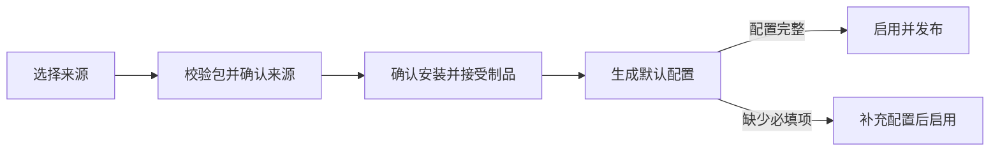

# 插件使用

插件“制品”是按 SHA-256 固定的代码与版本；“配置”是运行实例，保存普通设置、敏感设置和功能范围。
日常使用只维护一个当前配置，同一插件最多启用一个实例

[安装](#安装) · [完整信任](#完整信任) · [配置与启用](#配置与启用) · [使用](#使用) · [更新与卸载](#更新回退与卸载)

安装包必须满足宿主支持的 [SDK 合同](../backend/crates/gateway-plugin/sdk/README.md)、目标平台和宿主版本范围

合同不匹配时，需由作者使用匹配的 SDK 与 CLI 重新构建打包，不能只修改包内版本字段

## 安装

在“插件管理”点击安装图标，选择来源：

- **上传包**：选择发布者提供的 `tar.gz` 或 `tgz` 包
- **URL**：填写固定下载地址；支持 HTTPS，本机回环地址可使用 HTTP
- **GitHub**：填写仓库地址或 `owner/repo`；标签留空查询最新稳定版，预发行版须指定标签

公开来源无需认证。私有来源可选择或创建独立下载认证；认证按来源和用途限制，不会交给插件进程。
下载代理独立选择，默认直连，代理失败不会回退直连。SHA-256 用于固定内容，不证明发布者身份

“下一步”只解析和校验包，不保存制品。检查名称、发布者、版本、平台和摘要后确认安装。随宿主发行物导入的官方制品会显示为“待接受”，也必须先确认信任来源，
未接受的制品不能创建或编辑配置。相同摘要的确认可安全重试

确认安装后，若该插件还没有任何配置，宿主会：

1. 从 schema 填入普通配置默认值，不把敏感字段的默认值写入普通配置
2. 为需要实例范围的贡献项生成默认绑定；模型目录、管理页面、命令行和自动维护按声明注册，入口认证不自动绑定
3. 配置完整时直接启用并发布；仅缺少必填项时保存为停用并打开配置页

类型错误、非法 schema 或把敏感值混入普通配置会直接拒绝，不会伪装成“待配置”。更新已有插件时不会创建另一套配置，
管理端在包安装完成后提示确认切换，检查通过后应用目标版本，不兼容时保留原版本并打开待调整的设置

### 完整信任

插件以网关的系统身份运行，能够访问数据、凭据、配置和网络。安装即信任插件的代码与行为，安全由安装者承担；宿主不提供插件安全沙箱，也不通过权限清单承诺隔离

包格式、摘要和兼容性校验用于确认可加载性，不证明插件安全。只安装可信来源，并在升级前确认目标版本

## 配置与启用

在插件详情中直接启用或停用，设置会保留，无需重新填写。插件没有可设置的参数或认证映射时不显示设置入口

“设置”按当前包的 schema 显示参数，敏感字段单独保存且不回显。首次补齐必填项后“保存并启用”；其他设置修改保持
原有启停状态。请求处理能力随包自动注册，无需在安装时逐项勾选；可在“高级设置”中调整各挂载阶段的启停、顺序和失败处理。
模型请求阶段支持 Key、分组、模型等作用范围；HTTP、WebSocket 消息和服务调用全局生效，具体匹配由插件处理。
客户端 Key、账号分组、Provider 和模型等范围同时满足才生效，同一范围内任一值匹配即可

“事件观察”分别设置“请求完成与用量”和“上游 WebSocket 事件”；关闭其中一类不影响另一类。
观察用于接收事实；请求、响应或消息改写使用对应的中间件

范围数组为空表示不限制该维度。自动创建的默认绑定不预先绑定 Client Key；普通网关请求仍以实际请求的 Key 和冻结策略
执行。管理页面和命令行不保存功能 binding，页面调用模型时由页面每次明确选择一个 Client Key ID，宿主按当前 Key 状态、
范围、预算、账本和普通请求链执行，页面桥使用 Key ID

`frontend_authentication` 不会随安装自动接管入口。启用它时必须明确配置外部 principal 到既有 Client Key 的映射；
已停用或删除的 Key 不会因此恢复访问

存在多套配置时，可在“历史配置”中选择并确认替换当前配置，管理端只维护一个当前配置，不提供新增配置入口

若同一插件已有多个启用实例，需先整理为一套才能继续启用或更新，宿主不会自动停用实例或删除配置、密钥与私有数据

声明自动维护的插件可自行准备分组和 Key，无需提供管理员密码。停用会停止维护，但保留这些资源及其原生启用状态；
删除插件配置也不自动删除资源。需要撤销 Key 访问时，在 Key 管理中停用或删除相应 Key

“已启用”表示配置已经发布，不是外部服务的健康证明。“等待生效”表示候选仍在准备；“需要处理”会显示发布或运行失败原因。
并发编辑冲突时应重新加载当前 revision 后确认，不能覆盖另一窗口的修改

## 使用

| 功能 | 使用方式 |
| --- | --- |
| 管理页面 | 从插件详情或左侧插件导航打开；页面在隔离 iframe 中运行 |
| 自动维护 | 启用、重启及账号等配置变化后自动对账；失败重试，周期补漏 |
| 页面模型请求 | 每次选择 Client Key，经固定实例版本的 Responses 桥执行，返回原生 JSON 或 SSE |
| 请求中间件、模型路由、账号调度、重试策略、请求观察 | 匹配功能范围的正常网关请求自动使用；重试策略故障时交给后续处理 |
| 上游适配器 | 为内置 OpenAI / xAI 的生成请求提供上游实现；沿用宿主选号、代理、租约与结算，命中但不可用时拒绝请求 |
| 模型目录 | 启用后原子发布别名，列表与路由继承目标模型的能力和现有访问范围 |
| 基础数据页面 | 通过宿主数据回调读取账号基础信息与已有额度观测，展示本身不进入请求改写链 |
| 入口认证 | 客户端按插件协议访问，宿主把明确的 principal 映射到 Client Key |
| 命令行 | 在宿主环境运行 `codex-proxy-rs plugin <配置 ID> --help` |

页面模型桥要求管理会话、当前实例/制品/revision 均有效。停用实例、切换版本或 revision、
目标失效后，宿主会在等待首帧和交付响应期间持续复核并取消请求。页面用 Key 标识选择推理身份；
插件中间件仍可读取完整请求头并改写响应，页面桥不提供额外的插件安全隔离

## 更新、回退与卸载

### 版本与设置

- **检查更新**：GitHub 按保存的策略查询发布，URL 下载并解析当前地址的包；本地上传不支持查询。检查本身不会安装，GitHub 标签也不等于包内版本
- **更新插件**：选择新包并确认安装，再确认切换到目标版本。保留已填写的值，补充新版本缺失的默认值；字段改名、类型改变或删除等不兼容情况由用户调整，不猜测或静默清空参数与密钥
- **切换版本**：在版本列表中选择已安装版本，确认当前版本与目标版本后执行。若该版本已有恢复设置，使用它上次启用时提交的参数、密钥与功能范围；否则从当前设置生成草稿。切换保持启停状态，目标制品必须已接受。停用的历史配置引用旧版本时显示“历史配置”，不表示该版本正在运行
- **回退版本**：只列出同一插件已安装、已接受且保留恢复设置的较早版本，恢复对应设置后重新执行兼容检查

每个精确插件包保留最近一次启用时提交的配置快照，停用期间未完成的草稿不会覆盖恢复点

宿主升级仅能为当前启用配置建立恢复点，无法还原未保存或已丢失的其他版本设置

宿主元数据的可选字段增减不要求重新安装插件；清单、协议、能力或私有状态不兼容仍须处理。
宿主升级前的检查与恢复要求见[插件兼容与发行目录](../deploy/README.md#插件兼容与发行目录)

修改下载来源会先单独保存，取消后续安装也会保留已保存来源。当前浏览器标签页
记住未提交的安装参数和凭据引用，不保存认证明文或上传文件

设置恢复不等于私有数据恢复。私有数据迁移仍由插件声明的迁移能力处理，不兼容且无迁移路径时不能切换；迁移失败会尝试
恢复原版本，若恢复会覆盖并发修改则保持停用并提示处理。配置检查或候选准备失败不会覆盖当前设置

旧接口在兼容窗口内显示“接口待升级，当前仍兼容”，可查看剩余正式版本数与迁移说明，不改变插件的启停状态。请更新插件或联系作者升级接口，规则见 [接口弃用](../backend/crates/gateway-plugin/sdk/docs/manifest.md#接口弃用)

### 故障处理

宿主版本范围或能力版本不匹配时，管理页持续显示黄色兼容性提醒，仍允许手动启动和随宿主自动启动。
启动成功不代表语义兼容，警告不会自动消失。系统更新和回滚后的重启检查列出风险，确认后保留启用配置并逐个尝试启动

包无法解析、平台不符或 RPC 握手失败时，只有对应插件无法启动。运行中进程崩溃、协议错误或无效响应会停止该实例，
显示红色感叹号及脱敏错误详情，保留启用配置，可在详情中重新启动或切换版本。连续故障受重启次数限制

上游 429、用户请求错误和插件主动拒绝请求等业务结果不会直接停止插件。其他插件、原生转发和管理端继续运行，
不因单个插件故障撤销整个宿主的运行配置。命中故障插件绑定的请求仍遵循既有拒绝或委托策略，入口认证插件失败不会绕过认证

### 停用与删除

| 操作 | 删除什么 | 保留什么 |
| --- | --- | --- |
| 停用 | 不删除；新请求不再使用 | 配置、密钥、私有数据和版本 |
| 删除配置 | 该配置及其密钥、私有数据、版本配置快照；无法撤销 | 已安装版本 |
| 删除版本 | 所选制品、对应配置快照及其已无引用的下载认证；最后一个版本还会清理来源规则；被配置或在途调用引用时不能删除 | 其他版本与配置、共享下载认证 |
| 卸载插件 | 确认范围内的配置、数据、版本、来源规则及已无引用的下载认证 | 其他插件仍使用的下载认证、审计记录 |

卸载不是跨多个请求的事务；失败时会显示已完成结果，可重试剩余步骤，不会扩大到确认后新增的配置。只想暂时停用时不要卸载。
完整卸载后重新安装可重新选择来源。独立创建但未被删除版本使用的下载认证不会被顺带删除。
需要保留数据时，删除前按[部署、备份与恢复](../deploy/README.md)保存备份

开发插件见 [SDK](../backend/crates/gateway-plugin/sdk/README.md) 与 [插件 CLI](../backend/apps/plugin-cli/README.md)；
完整示例在独立的 `codex-proxy-plugins` 仓库维护。HTTP 字段与限制见 [API 参考](api.md#12-插件管理)
